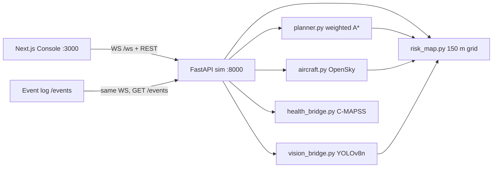

# AirGuard

**A BVLOS operations console for Downtown Dubai.** Simulated delivery drones fly missions over real OpenStreetMap restricted airspace while an operator adds traffic, draws no-fly rings, and drops placeable emergencies — and the planner detours, deconflicts, or escapes without a joystick.

> Same-laptop CodeCortex demo: Next.js on **:3000**, FastAPI on **:8000**. No database, no radio link, no physical UAV. Product code lives in [`drone-airspace-guardian/`](drone-airspace-guardian/). Runbook: [`drone-airspace-guardian/README.md`](drone-airspace-guardian/README.md). Restore notes for a new agent: [`drone-airspace-guardian/context.md`](drone-airspace-guardian/context.md).

---

## The problem

Low-altitude Dubai is already full. DXB and Al Minhad throw **approach funnels** across the city. Stadia, palaces, military sites, and power plants are no-go. Manned helicopters share the drone band. Crowds and trunk roads sit under every corridor. When an emergency zone appears mid-flight, “stop and wait” is not a plan.

A BVLOS operator needs one picture: **who is where, what is blocked, what will collide, and what the planner just did.**

## What we shipped

Things a judge can screenshot from the live console:

- **Weighted A\* on a 150 m Dynamic Risk Map** — distance, energy, altitude, ground risk, congestion, aircraft volumes, and original-route deviation, with hard cells at infinity. Routes are string-pulled into a few smooth legs. FastAPI calls this *hybrid adaptive airspace planning*: the grid search plus tactical climb / hold / detour when two tracks actually occupy the same 4-D cell.
- **Real OSM airspace, not a toy box** — 39 restricted polygons (airports, runway-approach funnels, military, Zabeel Palace, stadia, Meydan, power plants) with category buffers. Eight drone ports, hospitals / malls / districts as destinations. Built by `ml/build_airspace.py`.
- **Add drone** — `POST /drones` plans a mission; if the new track is predicted to conflict, the notice flashes *“Dxx launched. Conflict predicted with …”* and the resolver makes the lower-priority drone yield.
- **Placeable emergency escape** — **Trigger emergency**, pick 500 / 700 / 1000 / 1400 m, click the map. Drones inside fly the cheapest safe exit, then weighted A\* rejoins the original route past the zone (or diverts to a port if the destination is inside).
- **HUD annunciator** — **SAFE / CAUTION / CONFLICT / EMERGENCY**, plus airspace-risk, fleet health, average RUL, and **average battery** as a separate gauge. Battery drains with distance and climb; health is C-MAPSS remaining useful life.
- **Event log** (`/events`) — every `CONFLICT_PREDICTED`, manoeuvre candidate table, escape, reroute, and RUL update, filterable and exportable as JSON.
- **OpenSky aircraft + AU-AIR ground cameras + C-MAPSS RUL** — live OpenSky (or `AIR_TRAFFIC=replay` of eight DXB 30L tracks), six road cameras scored by VisDrone-fine-tuned YOLOv8n, health from `rul_model.joblib`.

The opening fleet is **eight** simulated drones (medical, parcel, food, survey, organ, security, retail — including a low-battery and a worn airframe). **Add drone** grows it. There are no five hardcoded Downtown loops.

## Architecture



State lives in the FastAPI process. CORS is `allow_origins=["*"]` for two ports on one laptop.

| Layer | What it is |
| --- | --- |
| Console | Next.js 16 / React 19 App Router, Leaflet, Esri World Imagery + CARTO labels |
| Sim | `sim.py` 1 Hz broadcast, 0.25 s physics, speeds **1× / 2× / 4×** |
| Planner | ε-weighted A\* (`ASTAR_EPSILON = 1.25`) + string-pull; escape planner in `emergency.py` |
| Deconfliction | 75 s 4-D prediction; 150 m horiz / 30 m vert; manned aircraft always win |
| ML | HistGradientBoosting RUL; YOLOv8n `yolov8n-airspace` |

## How a 90-second demo goes

UI copy is from `MapToolbar.tsx`, `TopBar.tsx`, `StatusPanel.tsx`, and `MapOverlays.tsx`. Open **http://localhost:3000**. Header should read **Live**. **Disconnected** / **Offline** means FastAPI is not on port 8000.

1. **0:00 — board.** Title **Dubai drone airspace**. Left rail: annunciator **SAFE** or **CAUTION**, **Fleet** with separate **Battery** and **Health** bars. Map: OSM restricted cores + soft buffers. Right: **Aerial detection feed**, **Ground monitor**, **Latest events**.
2. **0:15 — traffic.** Confirm **OpenSky live** or **OpenSky replay**. Helicopters on scheduled hospital / E11 / tour routes share the drone band; airliners are DXB arrivals and departures.
3. **0:25 — add a conflict.** Click **Add drone** (button reads **Planning route** while A\* runs). Watch the notice: *launched on a clear route* or *Conflict predicted with …*. The yielding drone climbs, holds, detours, or replans; the event log lists the candidates.
4. **0:40 — no-fly.** Click **Draw no-fly**, then the map. Hint: *Click the map to place a 450 m no-fly zone. Press Escape to cancel.* (Armed state: **Cancel no-fly**.) Drones already inside escape; others reroute before entry. Popup **Lift no-fly zone** calls `DELETE /zones/{id}`.
5. **0:55 — emergency.** Choose a radius, click **Trigger emergency**, click Downtown. Banner: *Dxx escaping the emergency zone by the shortest safe exit*. Original route stays as a dashed ghost until **Rejoining route**. Cap is three emergencies; oldest drops.
6. **1:10 — cameras & health.** **Ground monitor** cycles Sheikh Zayed / Al Khail / Marina sites. YOLO boxes set LOW→VERY HIGH traffic cost on the risk map. Fleet health is RUL mapped 0–100; battery is a different number.
7. **1:25 — log & reset.** **Event log** tab: *Every decision the planner makes, as it happens.* **Pause live updates**, filter, **Export … as JSON**. **Reset** restores the opening eight (*Airspace reset to the opening fleet.*) Speed buttons **1× 2× 4×** sit in the top bar.

## How to run

Two terminals, Windows PowerShell. The team Python env is `drone-airspace-guardian/ml/venv` (backend `requirements.txt` says so). Frontend defaults in `frontend/lib/config.ts`: API `http://127.0.0.1:8000`, WS `ws://127.0.0.1:8000/ws`. `npm run dev` is stock Next.js on **3000**.

### 1. Backend (FastAPI, 8000)

```powershell
cd drone-airspace-guardian\ml
python -m venv venv          # skip if ml\venv already exists
.\venv\Scripts\activate
python -m pip install -r requirements.txt
python -m pip install -r ..\backend\requirements.txt
cd ..\backend
$env:AIR_TRAFFIC = "replay"  # skip this line to poll live OpenSky
python -m uvicorn main:app --host 127.0.0.1 --port 8000 --reload
```

`AIR_TRAFFIC=replay` skips the OpenSky Network poll and replays the eight recorded DXB 30L flights in `ml/air_traffic.json`. Use it for a judge demo that must not depend on the network. Without YOLO (`ultralytics`), the map and planner still run; ground sites fall back to dataset labels.

Sanity check: `GET http://127.0.0.1:8000/` should report `"city": "dubai"`.

### 2. Frontend (Next.js, 3000)

```powershell
cd drone-airspace-guardian\frontend
npm install
npm run dev
```

Open http://localhost:3000.

| Variable | Default | Purpose |
| --- | --- | --- |
| `NEXT_PUBLIC_API_BASE_URL` | `http://127.0.0.1:8000` | REST |
| `NEXT_PUBLIC_WS_URL` | `ws://127.0.0.1:8000/ws` | `hello` / `state` / `events` stream |
| `AIR_TRAFFIC` (backend) | `live` | `replay` = recorded OpenSky at DXB |

## API

Defined in `backend/main.py`. Zone bodies are `{ "lat", "lon", "radius"? }` in metres. Defaults: operator **450 m**, emergency **700 m**.

| Method | Path | What it does |
| --- | --- | --- |
| `WS` | `/ws` | `hello` with event history, then `state` about every 1 s; `events` when something happened |
| `GET` | `/` | Service health: `city: "dubai"`, drone count, restricted-area count, OpenSky status, detector name |
| `GET` | `/world` | Static map: OSM polygons, ports, hospitals, ground sites, planner costs |
| `GET` | `/state` | Latest snapshot (drones, zones, aircraft, conflicts, HUD, ground) |
| `GET` | `/events` | Event history (`?limit=`, capped at 2000) |
| `POST` | `/drones` | Add a drone. Body `{ "mode": "auto" \| "random" \| "encounter" }` (toolbar sends `auto`) |
| `POST` | `/zones` | Operator no-fly ring. Conflict / escape runs immediately |
| `POST` | `/emergency` | Emergency zone (up to 3). Drones inside start an escape |
| `DELETE` | `/zones/{id}` | Lift a drawn zone |
| `POST` | `/sim` | Simulation speed `{ "speed": 1 \| 2 \| 4 }` |
| `POST` | `/reset` | Opening fleet, zones cleared, event log restarted |
| `GET` | `/media/auair/...` | AU-AIR frames when `ml/auair_frames/` exists |
| `GET` | `/media/visdrone/...` | VisDrone stills when `ml/vision_frames/` exists |

`POST /drones` returns `{ "drone": {...}, "predictedConflicts": ["D03", ...] }`.  
`POST /reset` returns `{ "status": "reset", "drones": <opening fleet size> }`.

## Datasets

Raw dumps stay off git. Training scripts default to local copies under `C:\Users\rohit\Downloads\Datasets\...`.

| Dataset | Role | On the live path? |
| --- | --- | --- |
| OpenStreetMap (Overpass) | `ml/build_airspace.py` → `ml/dubai_airspace.json` — restricted polygons, ports, roads, water mask | **Yes.** ODbL 1.0 |
| OpenSky Network | Live box around Dubai; replay file is eight arrivals/departures re-anchored to DXB runway **30L** | **Yes**, as *manned traffic*, not as drone missions. `AIR_TRAFFIC=replay` if live poll fails |
| NASA C-MAPSS FD001–FD004 | Train `ml/rul_model.joblib` (HistGradientBoosting: held-out RMSE **14.78** cycles, MAE 10.50, R² 0.877) | **Yes** — synthetic traces scored each health cycle. Not onboard UAV sensors |
| VisDrone2019-DET | Fine-tune YOLOv8n → `ml/weights/yolov8n_airspace.pt` | **Yes** as the detector. Val **mAP50 0.3182** (VisDrone-only val; 512×512 crops). Training is optional and not required to run the demo. |
| AU-AIR | Low-altitude road footage for six ground-monitor cameras (`ml/export_auair_frames.py`) | **Yes when exported.** Frames are gitignored (licence asks for links, not rebundling). Else VisDrone stills, or MEDIUM with an empty camera |

## Team

Folder ownership is [`.github/CODEOWNERS`](.github/CODEOWNERS). Stay in your directory unless a change is coordinated.

| Person | Role | Directory | GitHub | What they built |
| --- | --- | --- | --- | --- |
| **Joel** | Frontend | [`drone-airspace-guardian/frontend/`](drone-airspace-guardian/frontend/) | [@joelmathewgeorge](https://github.com/joelmathewgeorge) | Console + Event log: Leaflet map, HUD annunciator, MapToolbar, fleet gauges, OpenSky feed, ground cameras |
| **Pranav** | Backend | [`drone-airspace-guardian/backend/`](drone-airspace-guardian/backend/) | [@pranav3086](https://github.com/pranav3086) | FastAPI sim, WebSocket `/ws`, weighted A\*, risk map, zones, emergency escape, 4-D deconfliction |
| **Rohit** | ML | [`drone-airspace-guardian/ml/`](drone-airspace-guardian/ml/) | [@vrrroro](https://github.com/vrrroro) | C-MAPSS RUL, OSM `dubai_airspace.json`, OpenSky `air_traffic.json`, VisDrone YOLOv8n, AU-AIR export |

## Limitations

- The fleet is **software**. Nothing here commands or tracks a physical UAV.
- OpenSky live traffic is real ADS-B; replay tracks are **airliner** state vectors re-anchored to DXB, not Dubai drone flights. Anonymous OpenSky often rate-limits — use `AIR_TRAFFIC=replay`.
- Scheduled helicopters (MEDEVAC / POLICE / TOUR) are scripted on OSM hospitals and E11, not live rotorcraft.
- Health is a **turbofan** RUL model on stand-in traces. Battery is a separate energy model. Real airframe telemetry would need a new training set.
- Ground cameras are not a live gimbal. They replay AU-AIR (or VisDrone) stills. VisDrone is street-level aerial traffic, not Dubai and not drone-vs-drone. **mAP50 = 0.3182** — modest, not production detection.
- Planner numbers (150 m cells, 150/30 m drone separation, cost table) are demo policy, not certified UTM.
- Zones, fleet, and the event log are in-memory and vanish on process restart.
- Live UI is `app/page.tsx` → `Console`.
