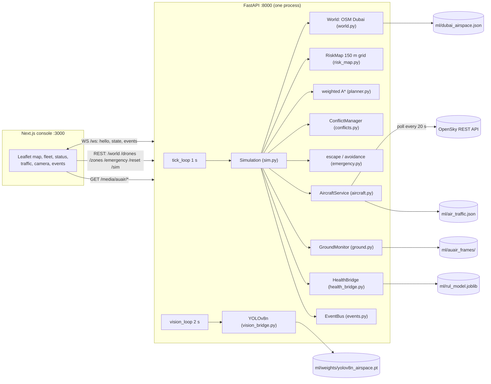

# Drone Airspace Guardian

A drone traffic-management console for Dubai. A fleet of simulated delivery, medical and patrol drones flies over the real Dubai operating area. Its restricted airspace comes from OpenStreetMap. Every route is planned with multi-objective weighted A* over a dynamic risk map. Every drone's 4-D trajectory (x, y, altitude, time) is predicted 45-75 s ahead, and conflicts are resolved automatically by priority. Manned aircraft (live or replayed OpenSky traffic plus scheduled helicopters) always have right of way. An operator can draw no-fly zones or declare emergency zones mid-flight, and drones already inside escape by the cheapest safe exit. Drone health comes from a model trained on NASA C-MAPSS run-to-failure data. Ground risk under the routes comes from a VisDrone-fine-tuned YOLOv8n scoring AU-AIR aerial camera footage.

It is a same-laptop hackathon build (CodeCortex): FastAPI on port **8000**, Next.js on port **3000**, no database, no real radio link, no physical drones.

> This document describes the code on `main` as of commit `6635ff8`. The last code change was `f02f44e` ("Land the hybrid airspace planner console"). A few older docs in the repo still describe the previous five-drone "Downtown loop" version. See [Stale documents](#stale-documents-in-the-repo).

---

## Contents

1. [Quick facts](#1-quick-facts)
2. [Team](#2-team)
3. [How to run it](#3-how-to-run-it)
4. [Architecture](#4-architecture)
5. [The world: real Dubai airspace](#5-the-world-real-dubai-airspace)
6. [The Dynamic Risk Map](#6-the-dynamic-risk-map)
7. [Route planning: multi-objective weighted A*](#7-route-planning-multi-objective-weighted-a)
8. [4-D trajectories and altitude](#8-4-d-trajectories-and-altitude)
9. [The simulation tick](#9-the-simulation-tick)
10. [Conflict prediction and deconfliction](#10-conflict-prediction-and-deconfliction)
11. [Manned aircraft](#11-manned-aircraft)
12. [No-fly zones and emergency zones](#12-no-fly-zones-and-emergency-zones)
13. [Battery and health](#13-battery-and-health)
14. [Ground risk monitor and the camera feed](#14-ground-risk-monitor-and-the-camera-feed)
15. [Missions and the fleet lifecycle](#15-missions-and-the-fleet-lifecycle)
16. [HUD status and the risk score](#16-hud-status-and-the-risk-score)
17. [Event log](#17-event-log)
18. [API and WebSocket reference](#18-api-and-websocket-reference)
19. [Frontend: what is on screen and how it is plotted](#19-frontend-what-is-on-screen-and-how-it-is-plotted)
20. [Datasets: what each one is and exactly how it is used](#20-datasets-what-each-one-is-and-exactly-how-it-is-used)
21. [The ML models](#21-the-ml-models)
22. [Tests and measured behaviour](#22-tests-and-measured-behaviour)
23. [Limitations: what is real and what is simulated](#23-limitations-what-is-real-and-what-is-simulated)
24. [Likely questions and answers](#24-likely-questions-and-answers)
25. [Repo layout](#25-repo-layout)
26. [Stale documents in the repo](#stale-documents-in-the-repo)

---

## 1. Quick facts

| | |
| --- | --- |
| Operating area | 25.02-25.30 N, 55.10-55.43 E: about 33.3 km × 31.0 km of Dubai |
| Planning grid | 150 m cells, 207 rows × 222 columns = 45,954 cells |
| Restricted airspace | 39 real areas from OpenStreetMap (airports, runway approach funnels, military, police, palace, stadiums, power plants, Meydan) |
| Drone ports | 8 (Dubai Marina, Al Barsha, Al Quoz, Business Bay, Jumeirah, Al Qusais, Mirdif, Al Warqa) |
| Opening fleet | 8 drones (medical, organ, parcel, food, survey, security, retail) |
| Drone altitude band | 40-150 m, cruise altitudes 60-120 m |
| Drone-drone separation | 150 m horizontal **and** 30 m vertical, at the same future second |
| Helicopter / airliner separation | 450 m / 90 m and 900 m / 150 m |
| Prediction horizons | 45 s detect, 75 s to vet manoeuvres, 60 s for aircraft |
| Sim clock | 1 s wall tick, 0.25 s physics sub-steps, speed 1×/2×/4× |
| Health model | HistGradientBoosting RUL on NASA C-MAPSS FD001-FD004, held-out RMSE 14.78 cycles |
| Vision model | YOLOv8n fine-tuned on VisDrone2019-DET crops, mAP50 0.2863 |
| Backend | Python, FastAPI + uvicorn, numpy; state in memory |
| Frontend | Next.js 16.3.5, React 19.2.8, Leaflet 1.9.4; no other runtime dependencies |

---

## 2. Team

Folder ownership is recorded in [`.github/CODEOWNERS`](.github/CODEOWNERS).

| Person | Role | Directory | GitHub |
| --- | --- | --- | --- |
| Pranav | Backend | `drone-airspace-guardian/backend/` | [@pranav3086](https://github.com/pranav3086) |
| Joel | Frontend | `drone-airspace-guardian/frontend/` | [@joelmathewgeorge](https://github.com/joelmathewgeorge) |
| Rohit | ML | `drone-airspace-guardian/ml/` | [@vrrroro](https://github.com/vrrroro) |

---

## 3. How to run it

Two processes on one machine. Use one Python environment for the backend and the ML code, because the backend imports `ml/predict.py` directly and runs YOLO in-process.

### Backend (FastAPI, port 8000)

```powershell
cd drone-airspace-guardian\backend
python -m venv .venv
.venv\Scripts\activate                       # macOS/Linux: source .venv/bin/activate
python -m pip install -r requirements.txt    # fastapi, uvicorn, websockets, numpy, certifi
python -m pip install -r ..\ml\requirements.txt   # scikit-learn/joblib/pandas for health, ultralytics for YOLO
python -m uvicorn main:app --host 127.0.0.1 --port 8000
```

Add `--reload` while developing. Leave it off for a demo, because a reload restarts the simulation.

### Frontend (Next.js, port 3000)

```powershell
cd drone-airspace-guardian\frontend
npm install
npm run dev
```

Open http://localhost:3000. The top bar shows **Live** when the WebSocket is connected and **Offline** if the backend is not reachable.

### Environment variables

| Variable | Where | Default | Effect |
| --- | --- | --- | --- |
| `AIR_TRAFFIC` | backend | `live` | `replay` skips the live OpenSky API and replays recorded flights instead |
| `OPENSKY_CLIENT_ID` / `OPENSKY_CLIENT_SECRET` | backend | unset | OAuth2 client for OpenSky: higher rate limit, 10 s polling instead of 20 s |
| `OPENSKY_POLL_S` | backend | 20 (10 with OAuth) | Poll interval for the live feed |
| `NEXT_PUBLIC_API_BASE_URL` | frontend | `http://127.0.0.1:8000` | REST base URL |
| `NEXT_PUBLIC_WS_URL` | frontend | `ws://127.0.0.1:8000/ws` | WebSocket URL |
| `CMAPSS_DIR`, `OPENSKY_CSV`, `AUAIR_DIR`, `VISDRONE_DIR`, `DUBAI_TILES_DIR` | ML scripts | Rohit's local paths | Where the raw datasets live when rebuilding artifacts |

### What works on a fresh clone and what needs local data

| Feature | Needs | In git? |
| --- | --- | --- |
| Map, restricted airspace, ports | `ml/dubai_airspace.json` | Yes |
| Replay airliners | `ml/air_traffic.json` | Yes |
| Scheduled helicopters | Nothing (built from the airspace file) | n/a |
| Live OpenSky traffic | Internet access to opensky-network.org | n/a |
| Health bars from the RUL model | `ml/rul_model.joblib` + scikit-learn 1.9.x | Yes |
| YOLO detections | `ml/weights/yolov8n_airspace.pt` + `ultralytics` | Yes |
| **Camera frames and dynamic ground risk** | `ml/auair_frames/` built by `ml/export_auair_frames.py` from a local AU-AIR copy | **No, gitignored** (AU-AIR's licence asks for links, not rebundling) |

Without `ml/auair_frames/` the backend falls back to `ml/vision_frames/` (VisDrone crops, also gitignored). Without either, every ground site stays at MEDIUM and the camera panel shows "Waiting for the first frame". Everything else still works.

### Rebuilding the data artifacts (optional)

```powershell
cd drone-airspace-guardian\ml
python build_airspace.py            # OpenStreetMap -> dubai_airspace.json (cached in ml/.cache/osm; --refresh to refetch)
python build_air_traffic.py         # OpenSky CSV -> air_traffic.json
python export_auair_frames.py       # AU-AIR -> auair_frames/ + index.json
python train_model.py               # C-MAPSS -> rul_model.joblib + model_metadata.json
python sanity_check.py              # 4 behavioural checks on the health model
python train_yolov8n.py             # VisDrone -> weights/yolov8n_airspace.pt + vision_metrics.json
```

---

## 4. Architecture



### Process and threading model (`backend/main.py`)

- There is one global `Simulation` object and one global `Detector`. All simulation state lives in memory.
- On startup the FastAPI `lifespan` hook starts two asyncio tasks:
  - `tick_loop`: every 1 s of wall time it runs `sim.step(1.0)` in a worker thread (`asyncio.to_thread`). It then serialises a snapshot, drains new events and broadcasts both to every WebSocket client. The loop sleeps for whatever remains of the second.
  - `vision_loop`: loads YOLO once. Then, every 2 s, it takes the next ground-camera job from the sim, runs detection in a worker thread and hands the result back to the sim.
- Every access to the sim goes through `sim.lock` (a `threading.RLock`). That covers the tick, REST commands and vision results. Blocking work runs in threads so the event loop stays responsive.
- Operator commands (`POST /drones`, `/zones`, `/emergency`, `DELETE /zones/{id}`, `/reset`) call `push_now()`. It broadcasts the resulting state and events immediately instead of waiting for the next tick.
- OpenSky polling runs on its own daemon thread (`OpenSkyPoller`), so a slow network never blocks the tick.
- CORS is `allow_origins=["*"]` because the UI and API run on different ports on one laptop. This is not a production setting.

---

## 5. The world: real Dubai airspace

**Files:** `backend/world.py`, `backend/geo_utils.py`, `ml/build_airspace.py`, `ml/dubai_airspace.json`

### Coordinate frame

Everything internal works in **metres** in a local flat-earth (equirectangular) frame centred on the operating box: x points east, y points north. `LocalFrame` uses 110,574 m per degree of latitude and 111,320·cos(lat₀) m per degree of longitude. Across a 30 km box that is accurate to about 0.1%, far below the 150 m grid, and it keeps distance and heading maths as plain vectors. Latitude/longitude are only used at the edges: when loading the data file and when writing the wire format.

### What `dubai_airspace.json` contains

It is built by `ml/build_airspace.py` from OpenStreetMap via the Overpass API. Raw responses are cached in `ml/.cache/osm/` so rebuilds are offline and repeatable. The data is licensed under ODbL.

| Layer | Count | How it was built |
| --- | --- | --- |
| Restricted areas | 39 | OSM `aeroway=aerodrome/heliport`, `landuse=military`, `leisure=stadium`, `building=stadium`, Meydan track, `power=plant`, plus two hand-picked ways (Zabeel Palace, Dubai Police GHQ). Polygons are simplified with Douglas-Peucker (12 m tolerance). Relations collapse to convex hulls. Tiny aerodromes (under 1 ha: the DXB vertiport pad) and district cooling plants (under 5 ha) are filtered out. |
| Runways | 3 | DXB 12L/30R, DXB 12R/30L, Al Minhad 09/27. OSM runway ways are merged by `ref`. The principal axis (from an SVD) gives the two ends, and each end is labelled by landing heading. |
| Approach funnels | 6 (counted in the 39) | Derived per runway end: 4 km out, 250 m either side of the centreline at the threshold, widening to 700 m. This is simulation policy, not a published procedure surface. |
| Hospitals | 78 | `amenity=hospital`, on land only |
| Malls | 110 | `shop=mall` |
| Crowd hotspots | 10 | The 10 largest malls by footprint (Dubai Mall, Mall of the Emirates, Ibn Battuta, Dubai Hills, Festival City, Mirdif City Centre and others) |
| Districts | 206 | `place=suburb/neighbourhood/quarter` nodes |
| Drone ports | 8 | One per preferred district. The district centre is used if it is on land and at least 800 m from restricted airspace; otherwise the nearest qualifying district within 3 km. |
| Roads | 607 ways | Motorway and trunk centrelines (E11 Sheikh Zayed Rd, E44 Al Khail Rd, E311, E66, D-roads…), simplified at 20 m |
| Water mask | 100 m raster | Built from the coastline's orientation (OSM draws coastline with land on the left). Each cell takes the side of its nearest coastline edge, found with a KD-tree. This is local, so a gap in the data cannot flood a whole district the way a flood-fill would. Large closed water ways (over 5 ha) are added. Stored bit-packed and base64-encoded. |

Restricted breakdown: 10 stadiums, 9 power plants, 6 approach funnels, 5 military areas, 3 government/police, 2 airports (Dubai International and Nad Al Sheba), 2 airfields (Skydive Dubai, Al Minhad Air Base), 1 palace (Zabeel), 1 racecourse (Meydan). Al Maktoum International (DWC) is south of the box (about 24.9 N) and is not included.

### What `World` does with it

- Converts every polygon to local metres, with a bounding box for fast rejects. `signed_distance` gives the distance to a polygon's outline, negative inside, vectorised in numpy.
- Assigns each restricted category a buffer width and cost from `RESTRICTED_POLICY` (see section 6). It builds a display outline of the buffer by growing the polygon by the buffer width and taking the convex hull.
- `destinations` = hospitals + malls + districts that are `is_clear`: inside the box with a 300 m margin, not on water, and at least 250 m from any restricted area. A drone is never sent somewhere it may not land.
- `random_destination` picks a destination of the right kind at 3.5-11 km from the origin.

---

## 6. The Dynamic Risk Map

**File:** `backend/risk_map.py`

Every hazard the planner cares about is a layer on the same 150 m grid. `cost_field(weights)` folds the layers into one **cost per metre flown** for one drone's plan. Hard cells come back as infinity. A cell costing 15 means one metre over it is as expensive as 15 metres of open airspace.

### Cost table (`backend/config.py`)

| Situation | Cost per metre |
| --- | --- |
| Open airspace | 1 (distance) + 0.4 (energy) at default weights |
| Buffer around government, power, stadium, racecourse | +5 |
| Cell used by 2 or more other drones' planned routes (congestion) | +10 |
| Ground risk HIGH (crowd hotspot, busy road camera) | +15 |
| Ground risk VERY HIGH (road camera) | +40 |
| Buffer around airport, approach funnel, airfield, military, palace, **operator no-fly zone** | +25 |
| Within 1.6× separation of a manned aircraft's predicted track | +100 |
| Emergency-zone buffer | +500 |
| Restricted core, operator/emergency zone core, aircraft's current safety volume | **∞ (hard block)** |

### Static layers (built once at startup)

| Layer | Meaning |
| --- | --- |
| `hard_static` | A cell is hard if any restricted polygon reaches into it: its signed distance from the cell centre is within 0.72 × 150 = 108 m, which covers the cell's corners. This is conservative, so hard cells extend up to about 108 m beyond real outlines. 3,089 cells are hard. |
| `zone_label` | Which restricted area owns each hard cell, so events can name it ("route ahead enters Zabeel Palace"). |
| `buffer_static` | Soft ring cost around each restricted core, width and cost by category. |
| `ceiling` | Maximum altitude: 150 m everywhere, **60 m inside airport and approach-funnel buffers**. |
| `ground_static` | 0 over water (29% of the box), 0.3 over urban land, 5 on motorway/trunk roads, 15 within 450 m of the 10 crowd hotspots. |
| `landing_dist` | Metres to the nearest drone port, used to keep degraded drones close to somewhere they can land. |

Buffer widths by category: airport 1500 m, airfield 500 m, military 400 m, palace 400 m, approach funnel 300 m, stadium 300 m, racecourse 300 m, government 250 m, power 250 m.

### Dynamic layers (change during the demo)

| Layer | Source | Updated |
| --- | --- | --- |
| `hard_zones`, `buffer_zones` | Operator no-fly rings and emergency zones (circles). Core is hard; the buffer is 200 m at +25 (no-fly) or 350 m at +500 (emergency). | When a zone is added or removed |
| `ground_dyn` | Ground-monitor camera levels. The full level cost applies at the site centre, tapering to half at its 700 m radius. | When a camera's level changes |
| `route_count` | How many planned routes pass through each cell | When routes change, or every 5 ticks |
| `aircraft_cost`, `aircraft_hard` | Predicted manned-aircraft tracks: +100 soft, hard within the separation radius of the aircraft's current position | Every tick |

`version` increments whenever a hard or buffer layer changes.

### The combined formula (`cost_field`)

```
cost = w.distance + w.energy
     + w.altitude  × max(0, cruise_alt − ceiling) / 40
     + w.risk_scale × ( w.ground × ground + w.traffic × (congestion + aircraft) + buffers )
     + w.landing   × metres_to_nearest_port / 1000          (degraded drones only)
     + w.deviation × min(distance_to_original_route, 2000) / 250   (replans only)
     + avoid                                               (temporary blobs from deconfliction)
cost[hard cells] = ∞
```

`ground` is the max of the static and dynamic ground layers. `buffers` is the max of the static and zone buffers. A drone's own planned cells are subtracted from `route_count` before congestion is computed, so a drone is never penalised for its own route. One crossing route is normal traffic that the 4-D predictor handles; two or more is treated as a corridor.

---

## 7. Route planning: multi-objective weighted A*

**File:** `backend/planner.py`

"Weighted" means two things here:

1. **The objectives are weighted.** Distance, energy, altitude, ground risk, traffic, buffers, landing proximity and deviation from the original route are folded into one per-metre cost using that drone's own `Weights` (section 13 explains how battery and health change them).
2. **The heuristic is inflated** by ε = 1.25 (`ASTAR_EPSILON`).

### The search

- 8-connected grid. The edge cost is `step_length × cell_size × (cost_here + cost_next) / 2`, where step_length is 1 for straight moves and √2 for diagonals. That is the trapezoidal integral of cost per metre.
- No diagonal squeezing: a diagonal move is refused if either of the two orthogonal neighbours is hard.
- Heuristic: octile distance × cell size × (the cheapest finite cell cost in the field) × 1.25. Without the 1.25 it is admissible, because no metre can cost less than the minimum cell cost. With the inflation the result is guaranteed within 25% of the optimal cost while expanding far fewer cells, so a replan fits inside a tick.
- The search stops after 250,000 expansions.
- **Start inside a hard cell** (for example a drone on a zone's rasterised edge, or an aircraft volume that just swept over it): the planner finds the shortest chain of cells out with a breadth-first search and opens only those at a steep cost of 60 per metre.
- **Goal inside a hard cell**: the goal moves to the nearest open cell (searching up to 40 rings out) and a note is added to the plan.

### String pulling

The raw cell path is a staircase. `string_pull` walks it and skips intermediate waypoints wherever the straight segment is clear of hard cells **and** its integrated cost is no more than the cost of the path it replaces (within 0.1% + 1). Routes come out as a few smooth legs that bend around zones. For example: "4.4 km, 6 legs, 106 cells searched in 7 ms".

### Measured performance

In my headless run, initial routes of 3.9-6 km planned in 5-13 ms with 24-660 cells expanded. `REPLANS_PER_TICK = 6` caps how many queued replans run in one tick.

---

## 8. 4-D trajectories and altitude

**File:** `backend/trajectory.py`

- A `Route` is a 2-D polyline with cumulative arc length `s`, plus an altitude profile sampled along `s`.
- `altitude_profile` samples the route every 40 m. The target at each sample is cruise altitude, capped by the local ceiling (60 m near airports) and floored at 40 m; the last sample is the landing altitude (0). A forward pass limits climbs to 4 m/s (as a slope relative to ground speed). A backward pass makes the drone start descending early enough to reach the target. The altitude the planner promises is therefore one the drone can actually fly.
- A `Motion` is the live state on a route: distance flown `s`, speed, current altitude, an optional `hold_until` time, and an optional `AltOverride`.
- An `AltOverride` is a temporary climb or descent over a stretch of route: it ramps up, holds, ramps down, and is blended into the base profile. `altitude_window()` builds one that is fully established a margin before the conflict point and held past it.
- `predict(motion, now, dts)` returns x, y, alt and s at each future time. It respects holds (no travel until `hold_until`) and caps vertical speed at 5 m/s. **Every conflict check in the system compares these predictions, not map lines.**
- A drone counts as landed below 12 m, and landed drones are excluded from conflict checks.

Drone physics (`backend/drones.py`, `Drone.step`): the drone advances `speed × dt` along the route (or hovers if holding), moves its altitude toward the target at up to 5 m/s, drains battery, and reports `"arrived"` when it reaches the end of the route and is at or below 12 m.

---

## 9. The simulation tick

**File:** `backend/sim.py`, `Simulation.step`. Called once per wall second. At speed 1×/2×/4× it advances 1/2/4 sim seconds.

1. **Physics sub-steps** of at most 0.25 sim seconds: every drone steps along its motion, and every aircraft moves.
2. **Manoeuvre bookkeeping** (`_housekeeping`):
   - Expired altitude overrides and holds are cleared.
   - Escaping drones that have left their zone go back to cruise speed and switch to rejoining.
   - Drones that reach their rejoin point emit `NO_FLY_AVOIDED` or `REROUTE_COMPLETED`.
   - A replanned route becomes the nominal route once the conflict that caused it is gone.
3. **Health**: every 15 airborne sim seconds, all airborne drones advance one model cycle and are scored in **one batched model call**.
4. **Battery thresholds**: LOW (<50%) and CRITICAL (<20%) trigger events, re-weighting or an abort.
5. **Missions**: turnarounds at destinations, charging and maintenance at ports, new launches.
6. **Aircraft**: every aircraft is predicted 75 s ahead, relevance and risk are computed, and their safety volumes are written to the risk map.
7. **Route validation**: every airborne drone's remaining route is checked against hard airspace. A drone found inside a zone starts an escape. A route that will enter a hard cell is queued for avoidance. This catches problems **before** the drone gets there.
8. **Replans** run from a queue in safety-priority order, at most 6 per tick: hard airspace (3), health (7), battery and ground risk (8). Lower numbers go first.
9. **Congestion**: route cells are re-rasterised when routes changed, or every 5 ticks.
10. **Conflict prediction and deconfliction** (`ConflictManager.update`).
11. Aircraft involved in an active conflict are marked HIGH risk.

---

## 10. Conflict prediction and deconfliction

**File:** `backend/conflicts.py`

### Detection: position, height and time together

Every tick, each airborne drone's motion is predicted at 1 s steps for 75 s and stacked into one numpy array. For every pair of drones and every second of the first **45 s**, the code checks:

```
conflict  ⇔  horizontal distance < 150 m  AND  vertical distance < 30 m  AND  both airborne
```

**A crossing on the map is not a conflict.** Two routes that cross are fine if the drones reach the crossing at different times or at different heights. The crossings list (below) makes that visible.

For each conflicting pair the manager records:
- Time to first violation (TTC).
- Closest point of approach (CPA): the minimum horizontal distance among the samples that are also vertically inside 30 m.
- The meeting point, for the map marker.

### Lifecycle

```
predicted ──(2 s decision delay, or immediately if TTC ≤ 8 s)──► resolving ──► resolved
     │                                                             │
     └── disappears on its own ──► resolved ("cleared")            └── 3 failed attempts ──► unresolved (20 s hold)
```

- A new conflict emits `CONFLICT_PREDICTED` and stays red for `DECISION_DELAY_S = 2 s`, so the operator sees it before anything moves. If TTC is 8 s or less it is resolved immediately.
- While a conflict is still predicted after a manoeuvre has been applied, the resolver tries again, up to 3 attempts. After that the conflict becomes `unresolved`: the yielding drone holds for 20 s and `CONFLICT_UNRESOLVED` is emitted.
- A conflict is **resolved** once the pair has passed its CPA by at least 1 s with actual separation greater than 150 m (or 45 s after CPA as a safety net). Resolved conflicts stay on screen for 5 s. `CONFLICT_RESOLVED` reports the closest approach actually observed.

### Who yields

Each drone gets a rank: `CRITICAL 4 > HIGH 3 > NORMAL 2 > LOW 1`, adjusted as follows:
- **+0.5** if battery < 30% or health < 40: degraded drones should not be the ones manoeuvring.
- **+3** if the drone is escaping an emergency zone: everyone else gets out of its way.

The lower rank yields. If the ranks tie, candidate manoeuvres are generated for both drones and the cheaper safe one wins. The event says why: "D04 selected as yielding drone (LOW vs NORMAL food)", or "(cheaper manoeuvre at equal priority)", or "(D07 is degraded…)".

### Candidate manoeuvres and their costs

For the yielding drone (`_drone_candidates`):

| Candidate | What it does | Cost |
| --- | --- | --- |
| Climb | To the other drone's altitude at CPA + 45 m (30 m separation + 15 m margin), established 195 m before the conflict point | 2 × Δalt × 12 × energy factor × aggressiveness factor |
| Descend | To the other drone's altitude − 45 m | Same formula |
| Hold | Hover for the first safe duration of 5, 10, 15, 20, 30 or 45 s | duration × (cruise speed + 22 × energy factor) |
| Lateral detour | Side-step 300 m or 500 m, on the side **away** from the other drone, then rejoin the route | extra metres × energy factor + 0.3 × offset |
| Weighted A* replan | Replan to the destination with a temporary +150/m blob (240 m radius) over the other drone's predicted positions around CPA, and a deviation weight of 0.6 to stay near the original route | extra metres × energy factor + 150 |

- Energy factor is 1.8 if battery < 50%. Aggressiveness factor is 2 if health < 50.
- Climbing a metre is costed like flying 12 m. Hovering a second is costed like flying 22 m.
- Climbs and descents outside 40-150 m, or above the local ceiling, are rejected as "outside allowed altitude band here".

**Every candidate is safety-checked** (`is_safe`) before it can be chosen. The drone's new motion is predicted for 75 s and checked for three things:
1. Separation against **every** other drone, not just the one in conflict.
2. The safety volume of every relevant aircraft.
3. That the path, plus 400 m beyond it, does not enter any hard cell.

Unsafe candidates get infinite cost, and the cheapest safe candidate is flown. All candidates, with their costs and rejection reasons, are attached to the `DECONFLICTION_STARTED` event and shown in a table on the Event log page.

Real example from a headless run:

```
D04 selected as yielding drone (LOW vs NORMAL food).
  climb to 115 m     safe   cost 1080
  descend to 25 m    REJECTED  outside allowed altitude band here
  hold 10 s          safe   cost 370    ← chosen
  detour 300 m right safe   cost 428
  detour 500 m right safe   cost 825
  replan +106 m      REJECTED  conflicts with D11 in 61 s
D04/D11 conflict successfully resolved via Hold 10 s. Closest approach 196 m horizontal.
```

### Route crossings (`_crossings`)

For every pair of airborne drones, the next 8 km of each route is intersected segment by segment. Each crossing reached within 240 s is labelled:

| Status | Meaning | Map marker |
| --- | --- | --- |
| `conflict` | This pair has an active predicted conflict | Covered by the conflict marker |
| `altitude` | At least 30 m of height difference at the crossing | Separated dot |
| `time` | Arrival-time gap × slower speed is at least 150 m | Separated dot |
| `watch` | Same time and height, but beyond the 45 s horizon for now | Watch dot |

This shows explicitly that lines crossing on the map are not automatically conflicts.

---

## 11. Manned aircraft

**File:** `backend/aircraft.py`. One shared Aircraft Data Service serves the whole fleet.

### Three sources

| Source | What it is | Kind |
| --- | --- | --- |
| **OpenSky live** (`AIR_TRAFFIC=live`, the default) | A background thread polls `https://opensky-network.org/api/states/all` for the box ±0.25°: every 20 s anonymously, or every 10 s with OAuth2 client credentials. On failure (network, HTTP 429, auth) it backs off exponentially up to 300 s. Each state vector is dead-reckoned from its own timestamp to now. On-ground aircraft and aircraft with no altitude are skipped. OpenSky category 8 means rotorcraft and is mapped to helicopter. Aircraft not seen for 60 s are dropped. | airliner / helicopter |
| **OpenSky replay** (when live is off or unreachable) | 8 real recorded flights from `ml/air_traffic.json` (6 arrivals, 2 departures) re-anchored to DXB runway 30L (section 20). A new one launches every 80 sim seconds, cycling through the list. | airliner |
| **Scheduled helicopters** (always present) | MEDEVAC 1 (Rashid Hospital ↔ Saudi German Hospital, 170 m, 52 m/s, lands 30 s at each end). MEDEVAC 2 (Dubai Hospital ↔ Kings Hospital, 190 m). POLICE 2 (patrol ping-ponging along Sheikh Zayed Road, snapped onto real E11 geometry, 160 m). TOUR 7 (loop Palm, Burj Al Arab, Burj Khalifa, back, 240 m). | helicopter |

The top bar shows which mode is active: **OpenSky live**, **OpenSky stale** (live worked earlier, no fresh data in the last 60 s) or **OpenSky replay**.

### Prediction, relevance and risk

- Every aircraft is extrapolated 75 s ahead with a **constant turn-rate, constant vertical-rate** model. The turn rate is smoothed from successive headings and clamped to 6°/s for helicopters and 3°/s for airliners.
- An aircraft is **relevant** (it matters to the drone layer) if it is within the box + 3 km **and** its predicted altitude dips to 310 m or below (150 m drone ceiling + 160 m). A cruising airliner at 10 km is ignored.
- Separation minima: helicopter 450 m horizontal / 90 m vertical; airliner 900 m / 150 m.
- On the risk map, each relevant aircraft gets:
  - A **hard block** within its separation radius around its **current** position.
  - A **+100/m soft cost** within 1.6× that radius around its **predicted** track (next 60 s, only the parts below 310 m).
- Risk shown in the UI:
  - LOW by default.
  - MEDIUM when a relevant aircraft is within 3 km of a drone.
  - HIGH when it is in an active conflict.
- `AIRCRAFT_DETECTED` fires once, when a relevant aircraft comes within 8 km of a drone.

### Drones always yield to manned aircraft

`_detect_aircraft` checks every drone against every relevant aircraft over 60 s with the aircraft's own minima. On a predicted violation the **drone always yields**, regardless of mission priority (even CRITICAL organ transport). Its candidates:
- **Descend** to aircraft altitude − separation − 10 m, if that is still at or above 40 m. There is no climb option: drones do not go over aircraft.
- **Hold** 10-60 s.
- **Lateral detour** of separation + 250 m, away from the aircraft.
- **A* replan** with a +300/m blob over the aircraft's predicted track.

The same `is_safe` check applies.

---

## 12. No-fly zones and emergency zones

**Files:** `backend/zones.py`, `backend/emergency.py`, `Simulation.add_zone` / `_start_escape` / `_avoid` in `backend/sim.py`

There are three kinds of "don't fly here":

| Kind | Where it comes from | Shape | Core | Buffer |
| --- | --- | --- | --- | --- |
| Real restricted airspace | OpenStreetMap, fixed at startup | Real polygons | Hard | Category-specific width and cost (section 6) |
| Operator no-fly zone | **Draw no-fly** button, then click the map | Circle, 450 m default | Hard | 200 m at +25/m |
| Emergency zone | **Trigger emergency** button + radius selector (500/700/1000/1400 m, default 700 m), then click the map | Circle | Hard | 350 m at **+500/m** |

- The API accepts radii of 100-3000 m.
- At most **4 operator zones** and **3 emergency zones** can exist at once. Adding one more drops the oldest of that kind, with a `ZONE_CLEARED` event.
- Any zone can be lifted from its map popup (`DELETE /zones/{id}`).
- Zones live in memory only.

### What happens when a zone is placed

1. The zone is rasterised into `hard_zones` and `buffer_zones`.
2. Airborne drones are split into two groups:
   - **inside**: currently within the core.
   - **approaching**: remaining route will enter any hard cell.
3. `EMERGENCY_CREATED` or `ZONE_CREATED` is emitted, naming the nearest real place and the drone counts. For example: "Emergency zone EZ-1 declared near Mediclinic (radius 700 m, 350 m buffer). 0 drone(s) inside, 1 on course into it."
4. Every **inside** drone starts an **escape**. Every **approaching** drone is **rerouted immediately** (no queue).
5. Conflict prediction reruns straight away, and the state is pushed to the UI without waiting for the next tick.

From then on, the per-tick route validation (section 9, step 7) keeps catching any route that would enter a zone.

### The Emergency Escape Planner (`plan_escape`)

A drone caught inside an emergency zone has two objectives that pull against each other: **get out by the shortest safe way**, and **stay close to the route it was flying**.

1. **Candidate exits** are placed every 10° (36 bearings), 230 m outside the zone's edge. That clears the 108 m rasterisation reach plus half a diagonal.
2. An exit is dropped if it is outside the box, or if the straight leg to it crosses other restricted airspace or an aircraft's hard volume.
3. Each remaining exit is scored:

   ```
   cost = 3.0 × escape distance        (time exposed inside the zone matters most)
        + 1.0 × deviation              (distance from the exit to the original route still ahead)
        + 0.5 × rejoin distance        (exit to the point where the original route resumes)
        + collision risk               (5000 if the straight escape leg would break separation with
                                        another drone's predicted position; otherwise 5 × how far inside
                                        300 m it passes)
        + 40 × ground cost at the exit (what the drone would be over)
   ```

4. The winning exit is flown **straight out** at escape speed: cruise × 1.35, capped at 26 m/s.
5. From the exit, weighted A* (with the zone now a hard block, deviation weight 1.0) routes to a **rejoin point**. That point is the first point on the original route 200 m past its last blocked stretch. The rest of the original route is kept.
6. **Divert instead of rejoin** in either of these cases, flying to the nearest drone port that is not inside the zone and emitting `MISSION_ABORTED`:
   - The destination lies inside the zone or its buffer.
   - The original route is blocked all the way to its end.
7. If no exit scored at all (the drone is boxed in by other airspace), it leaves radially, the shortest way out.
8. Events:
   - `EMERGENCY_ESCAPE_STARTED`, with bearing, escape distance, seconds to exit, number of exits scored and the exit point.
   - `EMERGENCY_ESCAPE_COMPLETED`, once it is outside and past the exit ("cleared Emergency 1 in 23 s").
   - `REROUTE_COMPLETED`, when it reaches the rejoin point.

While escaping, a drone ranks +3 in deconfliction, so other drones yield to it.

### Avoiding a zone ahead (`plan_avoidance`)

This applies to drones outside the zone whose route runs into it (or into any new hard block):
1. Find the rejoin arc on the original route past the blockage, at least 150 m ahead of the drone.
2. Run A* from the drone's current position to that point, with deviation weight 0.8, so the detour hugs the original route. Then append the rest of the original route.
3. If the route is blocked to its end, divert to the nearest port.
4. If no path exists at all, hold for 10 s and try again.

Events: `REROUTE_STARTED` ("route ahead enters Emergency 1 in 43 s; replanned around it with weighted A* (+612 m)"), then `NO_FLY_AVOIDED` ("flew around … without entering it and rejoined its original route").

### Emergency escalation in the UI

- The status annunciator switches to **EMERGENCY** while any emergency zone exists or any drone is escaping.
- The risk score gains +25.
- The alert banner reads "D07 escaping the emergency zone by the shortest safe exit".
- Emergency cores pulse on the map.

---

## 13. Battery and health

Battery and health are **separate on purpose**:
- **Battery** is the energy on board right now, and it drains with flying.
- **Health** is mechanical wear predicted by the ML model.

A drone can be fully charged and still be one the planner should keep away from crowds and close to a port.

### Battery model (`backend/config.py`, `Drone.step`)

| Drain / charge | Rate |
| --- | --- |
| Cruise | 1.6% per km |
| Climb | 0.012% per metre climbed |
| Hover (holding) | 0.035% per second |
| Idle electronics | 0.002% per second |
| Charging at a port | +1.2% per second |

| Threshold | Consequence |
| --- | --- |
| < 50% (`LOW_BATTERY`) | Event. If more than 1.5 km remain, the route is re-optimised with energy weights (queue priority 8). |
| < 20% (`CRITICAL_BATTERY`) | Event, then **mission aborted**: divert to the nearest drone port not inside a zone, for recharge. |
| Landing at a destination with < 45% | The next mission is a return to the nearest port (LOW priority). |
| At a port | Charges until ≥ 95%, then takes a new mission after an 8 s turnaround. |

### How battery and health change the planner's weights (`Simulation.weights_for`)

| Condition | energy | altitude | ground | traffic | risk_scale | landing |
| --- | --- | --- | --- | --- | --- | --- |
| Default | 0.4 | 0.3 | 1.0 | 1.0 | 1.0 | 0 |
| Battery < 50% | 1.2 | 1.0 | 0.6 | 0.8 | | |
| Battery < 20% | 2.5 | 1.5 | 0.4 | 0.6 | | |
| Health < 75 | | | | | 1.3 | 0.2 |
| Health < 50 | | | | | 1.8 | 0.6 |

- A low-battery drone values short, level routes: altitude changes cost energy.
- A worn drone "feels" every risk more (risk_scale multiplies ground, traffic and buffer costs) and is pulled toward ports (the landing weight adds cost per km from the nearest port).
- Note that low battery **lowers** the ground and traffic weights. This is a deliberate trade-off: a nearly empty drone gets home rather than taking a long safe detour.

### Health from the C-MAPSS RUL model (`backend/health_bridge.py` → `ml/predict.py`)

There is no real airframe telemetry, so each drone flies a **synthetic degrading sensor trace**, and the trained model scores it.

1. At registration, `simulate_drone_telemetry(num_ticks=200, failure_at=180, seed)` generates a 200-reading trace.
   - Every channel (3 operating settings and 21 sensors, exactly the C-MAPSS schema) starts at its **measured healthy FD001 mean** and drifts toward its **measured worn-out value**.
   - The drift follows `progress^2.2`: slow early, accelerating near failure, as real wear does.
   - Gaussian noise is added at each channel's measured noise level.
2. The drone's `wear` (0-1) sets where on the trace it starts: cycle 10 + 140 × wear. A fresh drone starts near cycle 10; a worn one (0.9) starts near cycle 136. The fleet is not eight clones at 100%.
3. A `HealthMonitor` is pre-filled with 20 warm-up readings so the rolling-window features are meaningful from the first score.
4. Every 15 airborne sim seconds (`HEALTH_MODEL_EVERY_S`), each airborne drone takes its next reading and **the whole fleet is scored in one batched `predict_rul_many` call**. Batching replaced a per-drone pandas pass that took about 80 ms per drone.
5. Health = predicted RUL / 125 × 100, clipped to 0-100. Status bands are identical on the ML side, the backend and the UI:

| Health | Status | Consequence |
| --- | --- | --- |
| ≥ 75 | healthy | none |
| 50-75 | monitor | `HEALTH_DEGRADED`, route re-optimised with raised risk weights (queue priority 7) |
| 25-50 | service soon | `HEALTH_DEGRADED`, same, stronger weights below 50 |
| < 25 | ground now | `CRITICAL_HEALTH`, **mission aborted**, divert to the nearest open port for maintenance |

- After 40 s of maintenance at a port, the drone's wear resets to 0.05 with a fresh trace ("maintenance complete: RUL 121 cycles").
- `RUL_UPDATED` fires whenever the predicted RUL moves by at least 8 cycles.
- If the model cannot load (missing joblib, scikit-learn version mismatch), the bridge falls back to `100 × (1 − progress^2.2)` on the same trace position. The HUD then shows the model name as "fallback curve", so it is never passed off as ML output.

---

## 14. Ground risk monitor and the camera feed

**Files:** `backend/ground.py`, `backend/vision_bridge.py`, `ml/export_auair_frames.py`, `frontend/components/GroundCamera.tsx`

### The monitor sites

Six "aerial camera" sites sit on real Dubai roads. Their approximate coordinates are snapped onto the nearest real OSM geometry of the named road within 1.5 km.

| Site | Road |
| --- | --- |
| GM-1 Sheikh Zayed Rd at Trade Centre | E11 |
| GM-2 Sheikh Zayed Rd at Al Barsha | E11 |
| GM-3 Al Khail Rd at Al Quoz | E44 |
| GM-4 Al Ittihad Rd in Deira | E11 |
| GM-5 Al Khail Rd at Business Bay | E44 |
| GM-6 Al Sufouh Rd at Dubai Marina | (not snapped) |

Each site watches a 700 m radius.

### Where the frames come from

`ml/export_auair_frames.py` cuts 6 windows out of AU-AIR:
- Each window is 240 consecutive frames, sampled every 8th frame so the scene moves, giving **30 frames per window, 180 in total**.
- The windows are chosen to hit target densities of about 26, 17, 11, 7, 4 and 1.5 labelled objects per frame.
- Frames are downscaled to 960×540 and written to `ml/auair_frames/`.
- An `index.json` holds each frame's real AU-AIR boxes, rescaled, plus the drone telemetry recorded with it: GPS, altitude (converted from the dataset's millimetres to metres) and velocity.

The backend sorts the sets busiest first, so GM-1 replays the busiest footage, and each site replays its own window in a loop.

Fallbacks:
1. If `auair_frames/` is missing: VisDrone crops in `ml/vision_frames/` with `truth.json`.
2. If neither exists: no camera footage, and all sites stay at MEDIUM.

### Scoring loop

1. Every 2 s, `vision_loop` takes the next site (round-robin) and that site's next frame.
2. **YOLOv8n** runs on the frame (confidence ≥ 0.2, imgsz 640). It uses `ml/weights/yolov8n_airspace.pt` (the VisDrone fine-tune, reported as `yolov8n-airspace`). If that is missing it uses a COCO `ml/yolov8n.pt` (not in git). If ultralytics is not installed, it counts the dataset's own labels instead, and the panel says "Scored by AU-AIR labels".
3. `score = vehicles + 2 × people`, where vehicles are car, van, truck, bus, motor, bicycle, trailer and tricycles. People count double because a drone falling on people is worse than on cars.
4. The score is smoothed (0.5 × previous + 0.5 × new) and bucketed: **LOW < 6 ≤ MEDIUM < 14 ≤ HIGH < 22 ≤ VERY HIGH**.
5. **Hysteresis**: a site steps down a level only once its smoothed score falls below 80% of the current level's floor. One quiet frame does not flap the map.
6. The level becomes ground cost on the risk map: MEDIUM +5, HIGH +15, VERY HIGH +40 per metre, full at the centre and tapering to half at 700 m.
7. When a site **rises to HIGH or VERY HIGH**, `GROUND_RISK_DETECTED` is emitted ("Sheikh Zayed Rd at Trade Centre: ground traffic HIGH. 12 vehicles and 2 people in view (yolov8n-airspace); overflight cost raised to 15/m within 700 m."). Every airborne drone whose remaining route passes within that site's radius is queued for a re-optimised route (priority 8).
8. When a site drops back below HIGH, `GROUND_RISK_CLEARED` is emitted.

### What the camera panel shows

The **Ground monitor** panel shows:
- **Cycling cameras**: the site that was scored most recently. Clicking a numbered tab or a camera icon on the map **pins** that site instead.
- The frame image, served from `GET /media/auair/<file>`.
- An SVG overlay of **YOLO detections**: coloured boxes with a class + confidence chip (person, car, van, truck, bus, motor…).
- An optional **"Show N dataset labels"** toggle that draws the AU-AIR ground-truth boxes dashed underneath, so detections can be compared to truth live.
- A per-class tally, the site's current level and overflight cost, which model scored it, and where AU-AIR originally recorded the footage (GPS and altitude).

This is **ground-activity context under the flight paths**. It is not drone-vs-drone detection and not a live gimbal feed.

---

## 15. Missions and the fleet lifecycle

**Files:** `backend/sim.py`, `backend/drones.py`

### Opening fleet (`SEED_FLEET`)

Each drone launches from a different port, flies to a destination of the right kind 4-10 km away, and starts part-way along its route so the map is busy immediately.

| Drone | Mission | Priority | Cruise alt | Speed | Battery | Wear | Why it is there |
| --- | --- | --- | --- | --- | --- | --- | --- |
| D01 | Medical supplies → hospital | CRITICAL | 100 m | 19 m/s | 92% | 0.10 | |
| D02 | Parcel → mall/district | NORMAL | 80 m | 17 m/s | 76% | 0.30 | |
| D03 | Food → district | NORMAL | 90 m | 16 m/s | 64% | 0.25 | |
| D04 | Infrastructure survey → district | LOW | 70 m | 15 m/s | 88% | 0.55 | |
| D05 | Organ transport → hospital | CRITICAL | 110 m | 20 m/s | 95% | 0.15 | |
| D06 | Parcel | NORMAL | 90 m | 18 m/s | 44% | 0.35 | Starts under 50%: shows energy-weighted routing |
| D07 | Security patrol → district/mall | HIGH | 120 m | 18 m/s | 83% | 0.20 | |
| D08 | Retail restock → mall | LOW | 70 m | 15 m/s | 70% | 0.90 | Worn airframe: reaches critical health a few minutes in, then aborts for maintenance |

The random generator is seeded (`seed=7`), so **Reset** always produces the same opening fleet.

Mission types and the priorities they can carry:
- Medical (CRITICAL/HIGH)
- Organ (CRITICAL)
- Parcel (NORMAL)
- Food (NORMAL/LOW)
- Retail (LOW/NORMAL)
- Survey (LOW)
- Security (HIGH)
- Return to port (LOW)

### Add drone (`POST /drones`, "Add drone" button)

- `mode=auto` (what the button sends): 70% of the time, if drones are airborne, it tries to set up an **encounter**.
  1. Pick a cruising drone, predict where it will be in 25-42 s, and approach that point at 60-120° to its track at its altitude.
  2. Launch the new drone from where it would need to start. The start must be on land, clear of restricted airspace, and not hard on the risk map.
  3. Aim it at a real destination beyond the meeting point.
  4. Try up to 4 setups and keep the one whose prediction actually shows a conflict.

  This makes the demo reliably produce a conflict to resolve. The notice says "D10 launched. Conflict predicted with D08."
- Otherwise it launches from a random destination or port to a random destination 3.5-11 km away.
- New drones get random speed (14-21 m/s), battery (usually 55-100%, sometimes 28-50%) and wear (usually 0.05-0.6, sometimes 0.72-0.88). Random low battery and high wear keep the degraded-drone logic visible.
- If no safe mission can be found, the API returns HTTP 409.

### After arrival

- Landing at a destination: after an 8 s turnaround the drone takes a new random mission. If its battery is under 45%, it returns to a port instead.
- At a port: it charges to 95% and does maintenance if flagged (40 s), then launches again.

The fleet runs indefinitely.

---

## 16. HUD status and the risk score

**Function:** `Simulation._hud`

### Status annunciator (first rule that matches)

| Status | When |
| --- | --- |
| **EMERGENCY** | Any emergency zone exists, or any drone is escaping |
| **CONFLICT** | Any conflict is predicted or unresolved, or any aircraft is HIGH risk |
| **CAUTION** | Any open conflict being resolved, a MEDIUM-risk aircraft, a HIGH/VERY HIGH ground site, or a weak drone (battery < 20% or health < 25) |
| **SAFE** | None of the above: "Every drone is separated in time or height" |

### Airspace risk score (0-100)

```
risk = 30 × min(1, open conflicts / 3)
     + 25 × (1 if any emergency zone else 0)
     + 15 × min(1, (HIGH aircraft + 0.5 × MEDIUM aircraft) / 2)
     + 15 × (1 − average fleet health / 100)
     + 10 × min(1, hot ground sites / 3)
     +  5 × min(1, weak drones / 2)
```

Labels: LOW < 20 ≤ MODERATE < 40 ≤ ELEVATED < 60 ≤ HIGH < 80 ≤ SEVERE.

The status panel also shows:
- Active drones and total drones.
- Manned aircraft (and how many are low).
- Predicted and resolved conflicts.
- Real no-fly zones (39) plus drawn zones, and emergency zones.
- Fleet health, average RUL and average battery.
- Ground alerts.

---

## 17. Event log

**File:** `backend/events.py`

Every decision the system makes is an event with:
- An id.
- A UTC timestamp and the sim time.
- A type and a severity.
- The drones involved.
- A human-readable message.
- Structured metadata. For example, deconfliction events carry the full candidate list; escape events carry the bearing, distance and exit point; route events carry length, cost and weights.

The last 2000 events are kept in memory. New events are streamed over the WebSocket each tick, and the full history (up to 800) is sent on connect.

| Severity | Types |
| --- | --- |
| info | DRONE_ADDED, ROUTE_GENERATED, ZONE_CLEARED, RUL_UPDATED, AIRCRAFT_DETECTED, GROUND_RISK_CLEARED, SIM_RESET |
| alert | CONFLICT_PREDICTED, AIRCRAFT_CONFLICT |
| warning | DECONFLICTION_STARTED, ALTITUDE_MANEUVER, HOLD_MANEUVER, DETOUR_MANEUVER, REROUTE_STARTED, ZONE_CREATED, LOW_BATTERY, HEALTH_DEGRADED, GROUND_RISK_DETECTED |
| success | CONFLICT_RESOLVED, REROUTE_COMPLETED, NO_FLY_AVOIDED, EMERGENCY_ESCAPE_COMPLETED, MISSION_COMPLETED, AIRCRAFT_CONFLICT_RESOLVED |
| critical | CONFLICT_UNRESOLVED, EMERGENCY_CREATED, EMERGENCY_ESCAPE_STARTED, CRITICAL_BATTERY, CRITICAL_HEALTH, MISSION_ABORTED |

---

## 18. API and WebSocket reference

**File:** `backend/main.py`. Base URL: `http://127.0.0.1:8000`.

| Method | Path | Body | Returns / does |
| --- | --- | --- | --- |
| GET | `/` | | Health check: service, status, `city: "dubai"`, drone count, restricted-area count, zone count, air-traffic status, detector name |
| GET | `/world` | | Static map: bounds, source/licence, restricted polygons with buffer outlines, ports, hospitals, crowds, runways, ground-monitor sites, and the planner constants (cell size, separations, horizon, altitude band, cost table, zone radii, sim speeds) |
| GET | `/state` | | Latest snapshot (same shape as the WS `state` message) |
| GET | `/events?limit=500` | | Event history (1-2000) |
| POST | `/drones` | `{"mode": "auto" \| "random" \| "encounter"}` | `{drone, predictedConflicts}`; 409 if no safe mission was found |
| POST | `/zones` | `{"lat", "lon", "radius"?}` (radius 100-3000 m, default 450) | Operator no-fly zone: `{zone, inside, approaching}`; 400 if outside the operating area |
| POST | `/emergency` | `{"lat", "lon", "radius"?}` (default 700) | Emergency zone, same response |
| DELETE | `/zones/{id}` | | Lift a zone; 404 if unknown |
| POST | `/sim` | `{"speed": 1 \| 2 \| 4}` | Simulation speed |
| POST | `/reset` | | Clears zones, conflicts, events and replay aircraft; reseeds the opening fleet; broadcasts `hello` with `reset: true` |
| GET | `/media/auair/...` | | AU-AIR frames (mounted only if `ml/auair_frames/` exists) |
| GET | `/media/visdrone/...` | | VisDrone frames (mounted only if `ml/vision_frames/` exists) |

### WebSocket `/ws`

The server pushes three message types. The client never needs to send anything.

| `type` | When | Payload |
| --- | --- | --- |
| `hello` | On connect, and after a reset | `events` (history), `reset?` |
| `events` | Every tick in which something happened | `events` (new ones only) |
| `state` | Every tick, and immediately after operator commands | `t` (sim seconds), `speed`, `tick`, `drones[]`, `zones[]`, `aircraft[]`, `conflicts[]`, `crossings[]`, `ground[]`, `feed` (the camera frame to show), `hud`, `airTraffic {mode, status}`, `healthModel {name, live}` |

Each drone in `state.drones` has:
- Identity and position: `id`, `lat`, `lon`, `alt`, `heading`, `speed`, `vspeed`.
- Condition: `battery`, `health`, `rul`, `healthStatus`.
- Mission: `priority`, `missionType`, `mission`, `origin`, `destination`, `home`.
- State: `phase` (cruise | escaping | rejoining | returning | landed | charging), `conflict` (none | predicted | resolving | resolved), `maneuver`, `routeKind` (planned | detour | replan | escape | avoid | return).
- Routes: `route` (remaining polyline), `original` (the route it is deviating from, if any), `cruiseAlt`, `etaS`, `distanceLeftM`.

---

## 19. Frontend: what is on screen and how it is plotted

**Directory:** `drone-airspace-guardian/frontend/`. Next.js App Router, React 19, TypeScript, Leaflet. There are no charting or state libraries: all rendering is Leaflet layers, SVG and CSS.

### Data flow (`components/AirspaceProvider.tsx`)

- One React context holds `world`, `state`, `events`, the connection status, the active tool, the selected drone and the pinned camera site.
- It loads `/world` once, retrying every 2 s until the backend is up.
- It opens the WebSocket and reconnects every 2 s if it drops.
  - `state` messages replace the snapshot.
  - `events` messages are appended, de-duplicated by id and capped at 2000.
  - `hello` messages replace the event history.
- It wraps every REST command (`lib/api.ts`) with busy flags, a 6 s notice ("Emergency EZ-2 placed. 1 drone escaping, 2 drones rerouting."), and an error toast that shows the backend's `detail` message.

### Layout (`components/Console.tsx`)

```
┌ TopBar: brand · Console | Event log (alert count) · T+mm:ss · 1× 2× 4× · OpenSky live/replay · Live ┐
├───────────────┬───────────────────────────────────────────────┬────────────────────┤
│ StatusPanel   │ "Dubai drone airspace"   [Add drone] [Draw no-fly]│ TrafficFeed        │
│  annunciator  │   [Trigger emergency][700 m ▾] [Reset]            │  (aircraft list)   │
│  risk bar     │ ┌───────────────────────────────────────────────┐ │ GroundCamera       │
│  10 metrics   │ │ AirspaceMap + AlertBanner + hint + notices     │ │  (YOLO frame)      │
│ FleetList     │ └───────────────────────────────────────────────┘ │ EventTicker        │
│  per drone    │ Legend                                            │  (last 6 events)   │
└───────────────┴───────────────────────────────────────────────┴────────────────────┘
```

### How the map is plotted (`components/AirspaceMap.tsx`)

- **Base layers**: Esri World Imagery (satellite) plus CARTO dark-only labels at 75% opacity. The map fits the operating box when `/world` arrives, and the box is outlined as a dashed rectangle.
- **Custom panes** fix the stacking order: zones (350) < routes (420) < labels (450) < marks (600) < craft (650).
- **Static world** (drawn once):
  - Every restricted core is a filled red polygon, with a tooltip giving the name, category and buffer width.
  - Its buffer outline is dashed: orange if the buffer costs 25 or more, gold otherwise.
  - Drone ports are small markers.
- **Drones**:
  - A `divIcon` with four animated rotors, rotated to the drone's heading via a CSS variable and coloured by **health**.
  - A tag shows the id and altitude.
  - CSS classes flag predicted, resolving, escaping, parked and selected.
  - Clicking a drone selects it (highlighted in the fleet list, raised z-index).
- **Routes**: each drone draws three polylines:
  - A dark casing.
  - A core coloured by health, with a CSS class that restyles it for conflict (red), escape, manoeuvre/detour/replan/avoid, or return to port.
  - A faint dotted **original route** whenever the drone is deviating from it.
- **Zones**:
  - A solid core circle and a dashed buffer circle: gold for no-fly, red for emergency.
  - Emergency zones also get a pulsing ring.
  - The core has a popup with a **Lift** button.
- **Aircraft**:
  - A plane or helicopter SVG rotated to its heading, coloured by risk (blue LOW, gold MEDIUM, red HIGH), tagged with callsign and altitude.
  - A trail of the last 24 positions.
  - A dashed **predicted track**, only when relevant.
  - A **safety-volume circle** at its separation radius, only when relevant, filled more strongly at HIGH risk.
  - A tooltip gives the speed in km/h, the source, and the distance to the nearest drone.
- **Conflict markers** at the predicted meeting point show the live countdown ("12 s"), then "Resolving", "Holding" or "Clear". The tooltip names both parties, the minimum separation and the manoeuvre chosen.
- **Crossing dots** mark route intersections that are separated in altitude or time, or on watch. The tooltip explains why they are not a conflict.
- **Ground sites** are dotted circles (700 m) coloured by level, with a camera icon. Clicking the icon pins that camera in the right panel.
- **Motion interpolation**: the backend ticks at 1 Hz. A `requestAnimationFrame` loop eases every drone and aircraft marker from its displayed position to the new one over 1000 ms (ease-out). This is skipped under `prefers-reduced-motion`.
- **Placing zones**: with a tool armed, the cursor changes and a hint shows the radius. The next map click posts the zone. **Escape** cancels.

### Other panels

- **StatusPanel**: the annunciator (SAFE / CAUTION / CONFLICT / EMERGENCY with a one-line reason), the risk bar, and 10 metrics (section 16).
- **FleetList**: one row per drone, with the id, a priority chip, the current state ("Hold 10 s", "Escaping emergency", "Rejoining route", "Charging 63%"…), the mission, and battery and health bars. Bar colours: battery teal ≥ 50, gold ≥ 20, red below; health uses the ML bands 75/50/25. The selected row expands to show RUL cycles, altitude and speed vs cruise, distance to go and ETA, and the home port.
- **TrafficFeed** (titled "Aerial detection feed"): the 7 nearest aircraft, with callsign, kind, source (OpenSky live / OpenSky replay / Scheduled route), altitude, distance to the nearest drone and risk. The header counts how many are in the drone layer.
- **GroundCamera**: section 14.
- **EventTicker**: the last 6 events. RUL updates and aircraft detections are hidden here to reduce noise.
- **Event log page (`/events`)**:
  - The full event history, filterable by severity, by family (Conflicts, Emergencies, Routing, Health and battery, Manned aircraft, Ground risk, Fleet) and by drone id or text.
  - The stream can be paused ("N new events waiting").
  - Each event expands to its metadata. Deconfliction events render the **candidate table**: each manoeuvre, safe or rejected with the reason, its cost, and the chosen one highlighted.
  - The shown events can be exported to JSON.

---

## 20. Datasets: what each one is and exactly how it is used

Raw datasets are **not** in git; they live on Rohit's machine under `C:\Users\rohit\Downloads\Datasets\`. Only derived artifacts are committed, where the licence allows it.

| Dataset | What it is | Processing script | Artifact | Used at runtime by | Committed? |
| --- | --- | --- | --- | --- | --- |
| **OpenStreetMap** (Overpass API) | Crowd-sourced map data | `ml/build_airspace.py` | `ml/dubai_airspace.json` (137 KB) | `world.py` → risk map, planner, ports, destinations, helicopter routes, camera sites | Yes (ODbL) |
| **OpenSky Network, recorded** | ADS-B state vectors captured over the Indian subcontinent: about 180 aircraft × 20 snapshots, about 18 s apart | `ml/build_air_traffic.py` | `ml/air_traffic.json` (83 KB, 8 flights) | `aircraft.py` replay mode | Derived slice yes; CSV no |
| **OpenSky Network, live** | The public REST API, polled for Dubai | none | none | `aircraft.py` live mode | n/a |
| **NASA C-MAPSS** FD001-FD004 | Simulated turbofan engines run to failure: 21 sensors + 3 settings per cycle, with train (to failure), test (cut off) and true RUL files | `ml/train_model.py`, `ml/sanity_check.py` | `ml/rul_model.joblib` (2.1 MB), `model_metadata.json` | `health_bridge.py` → drone health/RUL every 15 sim s | Model yes; raw no |
| **VisDrone2019-DET** | Drone photos of Chinese city traffic with boxes in 10 classes | `ml/train_yolov8n.py` | `ml/weights/yolov8n_airspace.pt` (5.9 MB), `vision_metrics.json` | `vision_bridge.py` → detector in the ground monitor | Weights yes; images no |
| **AU-AIR** | 32,823 frames from a Parrot Bebop 2 over traffic in Aarhus, Denmark, each with object boxes (8 classes) and the drone's synced GPS, altitude, velocity and attitude | `ml/export_auair_frames.py` | `ml/auair_frames/` (180 frames + `index.json`) | `ground.py` → camera footage, ground-risk levels | **No** (licence asks for links) |
| **Dubai aerial segmentation** (MBRSC / Humans in the Loop) | 72 Dubai satellite tiles with land-use masks | `ml/train_yolov8n.py --frames-only` copies 3 tiles into `vision_frames/` as `dubai-*.jpg` | none on the live path | **Not used** by the current backend: `ground.py` loads only `visdrone-*.jpg` from that folder | No |

### OpenSky → `air_traffic.json` in detail

The capture never passes Dubai, but it does contain real low-level flying: final approaches descending through 100-600 m and climb-outs. `build_air_traffic.py`:

1. Groups rows by aircraft (`icao24`), drops on-ground rows and duplicate timestamps, and keeps tracks with at least 10 fixes.
2. Picks **arrivals**: altitude falls by more than 250 m, the minimum is below 1200 m, and the mean speed is under 130 m/s. It keeps the 6 lowest. It picks **departures**: altitude rises by more than 600 m from a start below 1600 m, with a climb rate above 4 m/s. It keeps the 2 lowest starts.
3. Re-anchors each track to the real **DXB runway 30L** threshold taken from the OSM runway geometry. Dubai lands on runway 30 most of the year.
   - **Arrival**: the last recorded fix is placed on the extended centreline at the distance where a 3° glide path puts its altitude. All recorded headings are rotated so the final one matches the landing heading (301.3°). Positions are integrated **backwards** from recorded speed and heading. A modelled final segment finishes at the threshold at 15 m.
   - **Departure**: a modelled take-off roll and roughly 5° climb up to the first recorded altitude, then the recorded climb-out integrated forward.
4. Resamples everything at 2 s as `[t, lat, lon, alt_m, speed_ms, heading_deg, vrate_ms]`.

Flights in the file: arrivals UBA8502, ABY422, ABY471, LOT71, ETD218, IGO2369; departures DLH759, 80052d.

The **speed, altitude, vertical-rate and turn history are real**. The **location is re-anchored**.

### AU-AIR on Dubai roads, stated plainly

The camera footage is real drone video of real traffic, but it was recorded in Denmark. It is placed at six Dubai road locations as a stand-in for road cameras. The panel shows AU-AIR's original GPS so nobody is misled.

---

## 21. The ML models

### Health: RUL regression on C-MAPSS (`ml/cmapss.py`, `ml/train_model.py`, `ml/predict.py`)

**Data**
- All four subsets: 160,359 training cycles from 709 engines, and 707 test engines.
- Engine ids restart in every subset, so they are namespaced (`FD003_17`) before concatenating.

**Label**
- Remaining cycles until failure, **capped at 125**: the standard piecewise-linear target.
- An engine 200 cycles from failure looks the same as one 300 away, so the cap stops the model from wasting capacity separating indistinguishable states.

**Features** (145 after dropping constant columns)
- For each of the 24 raw channels:
  - The raw value.
  - A 5-cycle rolling mean.
  - A 20-cycle rolling mean.
  - A 5-cycle rolling standard deviation.
  - **Drift** from the engine's own first cycle, which cancels each engine's factory baseline.
  - **Trend**: the 5-cycle mean minus the 20-cycle mean, a cheap slope estimate.
- Plus `cycle`.
- Windows use `min_periods=1`, so a drone with two readings is featurised exactly like cycle 2 of a training engine.

**Training**
- Split by **engine, never by row**. Consecutive rows of one engine are near-identical, and a row split leaks.
- A Random Forest is tuned with `RandomizedSearchCV` + `GroupKFold(3)` on 35% of the engines, then refit with 300 trees.
- The challenger is `HistGradientBoostingRegressor` (600 iterations, learning rate 0.06, 63 leaves, early stopping).
- The winner is chosen on **NASA's held-out test files against the supplied true RUL**.

| Model | RMSE | MAE | R² | PHM08 score | Size |
| --- | --- | --- | --- | --- | --- |
| **HistGradientBoosting (shipped)** | **14.78** | **10.50** | **0.877** | **3095** | **2.13 MB** |
| RandomForest | 15.62 | 11.53 | 0.862 | 3497 | 86.7 MB |

- Per-subset RMSE (HGB): FD001 12.67, FD002 14.96, FD003 12.53, FD004 16.14. The six-operating-condition subsets are harder.
- Grouped CV RMSE was 16.5, and RMSE against **uncapped** truth is 24.3. Both are reported for honesty.
- PHM08 is the challenge's asymmetric score, which penalises late predictions ("fine" when it is about to fail) more than early ones.

**Inference**
- `latest_features()` computes only the newest row's features in numpy, instead of a full pandas rolling pass.
- `test_predict.py` asserts that it matches the training path to 1e-9.
- `HealthMonitor` keeps only the first reading (the drift anchor) and the last 21 readings, so memory is bounded without changing any feature.

**Sanity checks** (`ml/sanity_check.py`)
1. A held-out real engine's health declines over its life.
2. **Clock control**: a flat trace with every sensor held healthy while `cycle` climbs must stay materially healthier than a degrading trace. This proves the model reads wear and not the clock.
3. Fleet-wide Spearman correlation between predicted and true health.
4. The synthetic telemetry used by the backend behaves sanely.

### Vision: YOLOv8n fine-tuned on VisDrone (`ml/train_yolov8n.py`)

**Why the first attempt scored mAP50 = 0.** Whole 1360-2000 px VisDrone frames were downscaled to 320 px. A 30×20 px car became about 7×5 px, below what YOLOv8n's stride-8 head can resolve, so the head never saw a positive match.

**The fix**
- Cut **native-resolution 512×512 crops** centred on clusters of vehicles, with no downscaling, and train at imgsz 512.
- 924 train crops (21,928 boxes) and 107 val crops.
- **Classes**: the 10 VisDrone classes are merged into 6 legible ones: pedestrian + people → person, car, van, truck, bus, motor. Bicycle and the tricycles are dropped.
- Start from COCO-pretrained `yolov8n.pt`.
- 8 epochs on CPU, batch 8, `close_mosaic=2` (the last 2 epochs see un-mosaicked frames like inference does), no early stopping. It took 27 minutes.

**Results** (VisDrone val crops)

| Metric | Value |
| --- | --- |
| mAP50 | 0.2863 |
| mAP50-95 | 0.1531 |
| Precision | 0.351 |
| Recall | 0.3404 |

Per-class mAP50: car 0.627, person 0.381, motor 0.281, van 0.194, truck 0.128, bus 0.107.

This is modest detection, but good enough for a density signal: counting cars and people under a flight path. It is not safety-critical perception. At runtime it scores **AU-AIR** frames, which are a different domain from VisDrone (a different country, camera and altitude).

---

## 22. Tests and measured behaviour

```powershell
cd drone-airspace-guardian\backend
$env:AIR_TRAFFIC="replay"; python -m pytest -q test_planner.py   # 9 passed
cd ..\ml
python -m pytest -q test_predict.py                             # 4 passed
python backend\test_server.py    # smoke test against a running server (needs `websockets`)
```

`backend/test_planner.py` covers:
- A* never enters restricted airspace between real places.
- Crossing at different times is **not** a conflict.
- Same time and same height **is** a conflict, with a TTC in the expected range.
- Crossing separated by height is not a conflict.
- The lower-priority drone yields, the critical drone's route is untouched, and separation actually holds (≥ 90% of 150 m).
- A drone yields to a manned helicopter.
- An emergency escape leaves the zone by the shortest way, never re-enters, and rejoins the original route.
- A no-fly zone ahead is flown around, not through.
- Battery and health change the planning weights.

`ml/test_predict.py` checks that the fast numpy features match the pandas training features, that batched scores match single scores, and related invariants.

### Numbers from a headless run (replay traffic, 4× speed, 15 sim minutes)

- Startup (world, risk map, health model, 8 routes): about 3.4 s.
- Opening routes: 6.1-19.5 km.
- Average tick: **26 ms**, well inside the 1 s budget.
- 12 missions completed, 26 routes generated.
- D04 and D08 hit critical health (RUL 29 and 27 cycles) and aborted to ports for maintenance.
- One critical-battery diversion.
- One aircraft conflict predicted and resolved.
- With 4 "encounter" drones added: 4 conflicts predicted, each resolved with separation kept (closest approaches 196-588 m). The chosen manoeuvres were two 10 s holds, one lateral detour and one A* replan (+631 m).

---

## 23. Limitations: what is real and what is simulated

**Real**
- The restricted airspace, ports, hospitals, malls, roads and coastline (OpenStreetMap).
- Live OpenSky aircraft (when the API is reachable).
- The recorded flight dynamics in replay.
- The C-MAPSS training data and the model's measured accuracy.
- The VisDrone training data and the detector's measured mAP.
- AU-AIR frames, labels and telemetry.

**Simulated or adapted**
- **The drones.** A software fleet. Nothing commands or tracks a physical UAV, and there is no C2 link.
- **Health.** A turbofan-engine RUL model applied to synthetic traces generated in C-MAPSS's sensor space. It demonstrates the pipeline (trend features → RUL → health → planner reaction). A real product would retrain on real airframe telemetry: motor current, vibration, ESC temperature, battery internal resistance.
- **Replay airliners.** Real dynamics, re-anchored from India to DXB 30L.
- **Helicopters.** Scripted routes between real places.
- **Camera footage.** Danish traffic video placed on Dubai roads, replayed on a loop. It is not live. The frames are gitignored, so a fresh clone has no camera footage until `export_auair_frames.py` is run.
- **Separation minima, buffers, costs, approach funnels, the 60 m airport ceiling and the battery constants** are simulation policy chosen to make the demo legible. They are not certified standards or published procedures.

**Engineering limits**
- The planner searches in **2-D** (a 150 m grid) with an altitude profile along the route. Vertical manoeuvres (climb, descend) exist only in deconfliction. It is not a full 3-D or 4-D search.
- The 150 m grid is conservative: hard cells extend up to about 108 m beyond real outlines, and thin gaps between zones may be closed off.
- Aircraft prediction is constant turn-rate and constant climb-rate over 75 s, with no intent information.
- Anonymous OpenSky is rate-limited. The service degrades to "stale" and then to replay.
- There is no persistence or authentication, and CORS is open.
- Al Maktoum International (DWC) lies outside the operating box.

---

## 24. Likely questions and answers

**Q: Two drones' routes cross on your map. Why isn't that a conflict?**
Conflicts are checked in 4-D. Both drones are predicted second by second for 45 s, and a conflict needs < 150 m horizontal **and** < 30 m vertical **at the same second**. The crossing dots show crossings that are separated by height or by arrival time, and the dot's tooltip says which.

**Q: Who decides which drone moves?**
Priority rank: CRITICAL > HIGH > NORMAL > LOW. A degraded drone (battery < 30% or health < 40) gets +0.5, and a drone escaping an emergency gets +3. The lower rank yields. On a tie, both drones' options are evaluated and the cheaper manoeuvre wins. A manned aircraft always wins, whatever the mission.

**Q: How do you choose the manoeuvre?**
The yielding drone gets up to 6 candidates: climb, descend, hold, 300 m detour, 500 m detour and weighted A* replan. Each has an energy-based cost. Each is re-predicted for 75 s against **every** drone, every relevant aircraft and all hard airspace. Unsafe candidates are discarded, and the cheapest safe one is flown. The full table is in the event log.

**Q: What if nothing works?**
It retries up to 3 times as the geometry changes. After that it declares the conflict **unresolved** and the yielding drone holds in place for 20 s (`CONFLICT_UNRESOLVED`, critical).

**Q: Is it really A*? Is it optimal?**
It is A* on an 8-connected 150 m grid with an admissible octile heuristic scaled by the minimum cell cost, then inflated by ε = 1.25. That makes it *bounded-suboptimal*: at most 25% above the optimal cost, in exchange for far fewer expansions (5-13 ms per plan). String pulling then removes grid staircases without increasing cost.

**Q: What does "multi-objective" mean concretely?**
Each cell's cost per metre is distance + energy + altitude-ceiling penalty + risk_scale × (ground risk + traffic + buffers), plus optional near-port and route-deviation terms. The weights are per drone and change with battery and health. See the table in section 13.

**Q: What happens when I drop an emergency zone on top of drones?**
- Drones inside score 36 exits around the zone: escape distance ×3, deviation ×1, rejoin distance ×0.5, collision risk, and ground risk at the exit.
- They fly straight out at 1.35× cruise speed.
- A* then routes them around the now-blocked zone to rejoin their original route, or diverts them to the nearest open port if their destination is inside the zone.
- Drones heading toward the zone are rerouted before they reach it.
- The emergency buffer costs 500/m, so traffic gives it a wide berth.

**Q: Why 150 m / 30 m separation?**
It is simulation policy, sized to be visible on a city-scale map with GPS-grade drones. It is configurable in `config.py`. Manned aircraft get larger volumes: 450 m / 90 m for helicopters and 900 m / 150 m for airliners.

**Q: Is the air traffic real?**
In live mode, yes: OpenSky state vectors over Dubai, dead-reckoned between 10-20 s polls. When OpenSky is unreachable or `AIR_TRAFFIC=replay` is set, we replay 8 real recorded flights whose speed, altitude and turn history are real but which are re-anchored onto DXB runway 30L. The helicopters are scripted. The UI labels each aircraft's source.

**Q: Where does drone health come from? Is it real drone data?**
No. It is a gradient-boosting RUL model trained on NASA's C-MAPSS turbofan run-to-failure data (held-out RMSE 14.8 cycles). It is fed synthetic sensor traces whose healthy values, noise and wear drift were measured from the real engines. It shows the pipeline end to end: trend features, then RUL, then health bands, then the planner reacting. Real drones would need retraining on airframe telemetry.

**Q: Why use a jet-engine dataset for drones?**
C-MAPSS is the standard public run-to-failure benchmark with ground-truth RUL. No comparable public dataset exists for small UAV airframes. The modelling approach (engine-grouped splits, trend and drift features, capped RUL, an asymmetric scoring check) transfers directly.

**Q: What does the camera actually do?**
It replays real AU-AIR drone footage (recorded in Denmark) at six Dubai road sites. YOLOv8n fine-tuned on VisDrone counts vehicles and people. `vehicles + 2 × people` sets a LOW/MEDIUM/HIGH/VERY HIGH ground-risk level, with smoothing and hysteresis. That level adds 5/15/40 per metre to routes within 700 m, and a jump to HIGH triggers replans of drones heading over that stretch.

**Q: mAP50 of 0.29 sounds low.**
It is modest, and we say so. It comes from 8 CPU epochs on 924 crops, measured on VisDrone val. Cars (the class that drives the density score) reach 0.63. The detector feeds a coarse density bucket with hysteresis, not collision avoidance. If YOLO is unavailable the system counts the dataset's labels instead, and says so.

**Q: How fast is it? Does it scale?**
A tick with 8-12 drones and 8 aircraft takes about 26 ms. A* plans take 5-13 ms. Conflict detection is vectorised numpy over all pairs × time steps: O(n²·T), fine for tens of drones. At most 6 replans run per tick. Beyond about 100 drones you would move to spatial hashing and asynchronous planning.

**Q: How do you avoid race conditions between the tick, REST calls and YOLO?**
All sim access goes through one `RLock`. Heavy work (the tick, YOLO inference) runs in worker threads via `asyncio.to_thread`, so the event loop keeps serving the WebSocket. OpenSky polling is a separate daemon thread that hands batches over through a lock.

**Q: How does the map stay smooth at 1 Hz?**
The frontend eases each marker from its displayed position to the new one over 1000 ms in a `requestAnimationFrame` loop. The backend only sends state once per second.

**Q: Why does a low-battery drone accept more ground risk?**
The weights deliberately trade some ground and traffic weight for energy. A drone at 15% battery that takes a long "safe" detour can end up falling out of the sky, which is the bigger risk. Below 20% it aborts to the nearest port anyway.

**Q: What happens on restart?**
Everything is in memory. A restart (or **Reset**) reseeds the same 8-drone opening fleet, because the random generator is seeded.

---

## 25. Repo layout

```
.github/CODEOWNERS
README.md                           ← this document
drone-airspace-guardian/
  backend/                          Pranav: FastAPI + simulation
    main.py                         app, WS, REST, tick and vision loops
    config.py                       every tunable number
    sim.py                          Simulation: fleet, tick, commands, HUD
    world.py                        Dubai world from dubai_airspace.json
    geo_utils.py                    local metre frame, headings
    risk_map.py                     Dynamic Risk Map, cost field
    planner.py                      weighted A* + string pulling
    trajectory.py                   Route, altitude profile, Motion, predict
    drones.py                       Drone state, physics, battery, wire format
    conflicts.py                    4-D conflict detection, deconfliction, crossings
    emergency.py                    emergency escape + no-fly avoidance
    zones.py                        operator / emergency zones
    aircraft.py                     OpenSky live/replay + helicopters
    ground.py                       ground-risk monitor (camera sites)
    health_bridge.py                C-MAPSS RUL model bridge
    vision_bridge.py                YOLOv8n loader/inference
    events.py                       event bus + types
    test_planner.py  test_server.py requirements.txt
  frontend/                         Joel: Next.js console
    app/layout.tsx  app/page.tsx  app/events/page.tsx  app/globals.css
    components/AirspaceProvider.tsx Console.tsx AirspaceMap.tsx MapToolbar.tsx MapOverlays.tsx
               StatusPanel.tsx FleetList.tsx TrafficFeed.tsx GroundCamera.tsx EventTicker.tsx
               EventLog.tsx TopBar.tsx
    lib/api.ts config.ts format.ts health.ts
    types/airspace.ts
  ml/                               Rohit: data builders + models
    build_airspace.py → dubai_airspace.json
    build_air_traffic.py → air_traffic.json
    export_auair_frames.py → auair_frames/ (gitignored)
    cmapss.py train_model.py predict.py sanity_check.py test_predict.py
    rul_model.joblib model_metadata.json health_degradation.png
    train_yolov8n.py → weights/yolov8n_airspace.pt, weights/vision_metrics.json
    requirements.txt
docs/superpowers/                   design spec + plan for an earlier frontend
tmp/                                pitch deck builder and assets
```

---

## Stale documents in the repo

`drone-airspace-guardian/README.md` (runbook) and `drone-airspace-guardian/context.md` (restore notes) were refreshed for this version in `a0853eb` / `6635ff8` and agree with this document.

These still describe the earlier five-drone "Downtown Dubai loop" version, which used `missions.py` / `trajectories.json` paths, a single "Helicopter inbound" ring, a perpendicular-offset reroute and a mock data mode. Where they disagree, **the code is current**:

- `drone-airspace-guardian/ml/README.md`: the C-MAPSS sections are accurate; the "Trajectories" section is not.
- `drone-airspace-guardian/ml/PROMPT.md`, `EXTENSION_PROMPT.md`: the original build prompts, not the architecture.
- `docs/superpowers/specs/…` and `docs/superpowers/plans/…`: the earlier frontend design.
