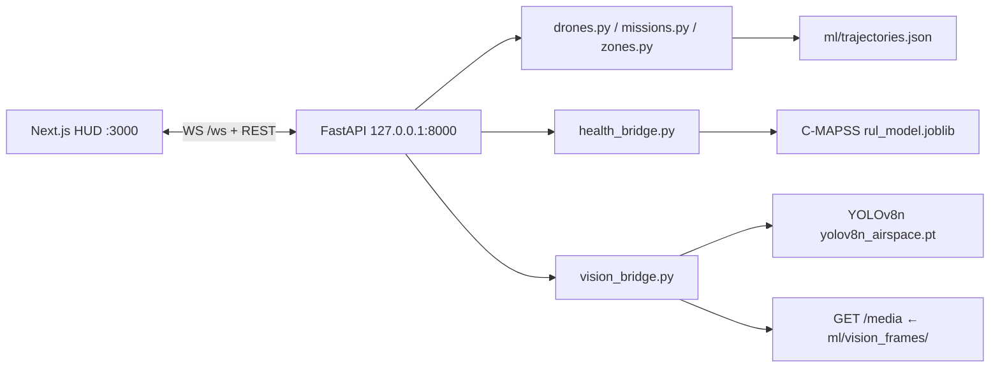

# Drone Airspace Guardian

A live **Beyond Visual Line of Sight (BVLOS)** safety console over Downtown Dubai. Five simulated delivery drones fly named missions around Burj Khalifa while an operator draws no-fly rings, declares an inbound helicopter, and watches the fleet detour in place. Health bars come from a trained NASA C-MAPSS remaining-useful-life model. A camera dock runs a VisDrone-fine-tuned YOLOv8n on cycling aerial stills.

This is a same-laptop CodeCortex demo: Next.js on port **3000**, FastAPI on **8000**, no database, no real radio link. Product code lives in [`drone-airspace-guardian/`](drone-airspace-guardian/). Deep restore notes: [`drone-airspace-guardian/context.md`](drone-airspace-guardian/context.md). Operational runbook: [`drone-airspace-guardian/README.md`](drone-airspace-guardian/README.md).

## Team / roles

Folder ownership is recorded in [`.github/CODEOWNERS`](.github/CODEOWNERS). Stay in your directory unless a change is coordinated.

| Person | Role | Directory | GitHub | What they built |
| --- | --- | --- | --- | --- |
| **Joel** | Frontend | [`drone-airspace-guardian/frontend/`](drone-airspace-guardian/frontend/) | [@joelmathewgeorge](https://github.com/joelmathewgeorge) | Next.js App Router HUD: Leaflet map, fleet panel, conflict banner, camera dock, **Draw no-fly** / **Helicopter inbound** / **Reset demo** |
| **Pranav** | Backend | [`drone-airspace-guardian/backend/`](drone-airspace-guardian/backend/) | [@pranav3086](https://github.com/pranav3086) | FastAPI simulation, WebSocket `/ws`, in-memory zones, geometric reroute, `POST /emergency` and `POST /reset` |
| **Rohit** | ML | [`drone-airspace-guardian/ml/`](drone-airspace-guardian/ml/) | [@vrrroro](https://github.com/vrrroro) | C-MAPSS RUL (`rul_model.joblib`), OpenSky → `trajectories.json`, VisDrone YOLOv8n (`yolov8n_airspace.pt`) |

## What it does

- **Five drones** on looped Downtown Dubai missions (Marina clinic, Palm grocery, Sheikh Zayed survey, DIFC parts, organ to Emirates Hospital). Paths are OpenSky ADS-B shapes fitted into a box around 25.1972 N, 55.2744 E.
- **Draw no-fly** — arm the control, click the map, drop a **450 m** operator ring (cap of four). Intersecting drones mark **Rerouting** and the conflict banner updates.
- **Helicopter inbound** — one **900 m** emergency ring on the Dubai center. A new emergency **replaces** the previous one (no stacked red fills).
- **Health degradation** — left **Fleet** panel bars from C-MAPSS RUL on stand-in telemetry, not random jitter.
- **Camera dock** — right panel cycles aerial stills with YOLOv8n boxes (person, car, van, truck, bus, motor). Ground-activity context, not drone-vs-drone detection.
- **Reset demo** — clears zones, restores the five missions, resets health monitors.

## How it works

Two processes, two ports. State lives in the FastAPI process. CORS is `allow_origins=["*"]` for local development.



```
Browser  (Next.js, http://localhost:3000)
   |  Leaflet map + Fleet panel + Camera dock
   |  WS   ws://127.0.0.1:8000/ws
   |  HTTP GET  /  /state  /zones  /media/<frame>
   |  HTTP POST /zones  /emergency  /reset
   v
FastAPI  (uvicorn, http://127.0.0.1:8000)
   |-- simulation_loop (~1 s)  drones.py tick / reroute / proximity
   |-- zones.py                in-memory circles (emergencies replace, operators cap at 4)
   |-- health_bridge.py        ml/predict.py + rul_model.joblib
   |-- vision_bridge.py        YOLOv8n every 3 ticks
   '-- StaticFiles /media      ml/vision_frames/ when that directory exists
```

**Datasets in the live path**

| Dataset | Role | On the live path? |
| --- | --- | --- |
| OpenSky ADS-B | `ml/build_trajectories.py` → `ml/trajectories.json`; `missions.py` fits dense waypoints into Downtown | Yes. Fallback legs in `drones.py` if the JSON is missing |
| NASA C-MAPSS FD001–FD004 | Train `ml/rul_model.joblib` (HistGradientBoosting) | Yes — `health_bridge.py` scores synthetic traces each tick. Not onboard UAV sensors |
| VisDrone2019-DET | Fine-tune YOLOv8n → `ml/weights/yolov8n_airspace.pt` | Yes — `vision_bridge.py` on cycling stills. Frames are gitignored |
| Dubai aerial plates | Map context | Yes — `frontend/public/dubai/tile-a.png` … `tile-d.png` |
| AU-AIR | Prompted as real UAV missions | **Not used.** No `au_air_missions.py` / `.json` in the tree |

Raw captures are not in git. Training scripts default to local copies under `C:\Users\rohit\Downloads\Datasets\...`.

## How to run

Ports match the code: `frontend/lib/config.ts` defaults `NEXT_PUBLIC_API_BASE_URL` to `http://127.0.0.1:8000` and `NEXT_PUBLIC_WS_URL` to `ws://127.0.0.1:8000/ws`. `npm run dev` is stock Next.js on **3000**. `uvicorn` is started on **8000**. `--reload` watches Python files and restarts the API; useful locally, omit it if you want a stable demo.

Use one Python environment. Install `backend/requirements.txt` for the server and health model, then `ml/requirements.txt` if you want the camera HUD (`ultralytics`). Without YOLO, the map and reroutes still run; `vision_bridge` logs that the detector is unavailable.

### 1. Backend (FastAPI, 8000)

```powershell
cd drone-airspace-guardian\backend
python -m venv .venv
.venv\Scripts\activate
python -m pip install -r requirements.txt
python -m pip install -r ..\ml\requirements.txt
python -m uvicorn main:app --host 127.0.0.1 --port 8000 --reload
```

Sanity check without the UI:

```powershell
python -m websockets ws://127.0.0.1:8000/ws
```

You should see a JSON `positions` message about once a second with `"city": "dubai"`.

### 2. Frontend (Next.js, 3000)

In a second terminal:

```powershell
cd drone-airspace-guardian\frontend
npm install
npm run dev
```

Open http://localhost:3000. The header feed should read **Live** once the WebSocket connects. **Disconnected** means the UI is up but FastAPI is not reachable on port 8000.

Optional environment (defaults if unset):

| Variable | Default | Purpose |
| --- | --- | --- |
| `NEXT_PUBLIC_DATA_MODE` | `live` (anything other than `mock`) | `mock` uses the in-browser simulator only |
| `NEXT_PUBLIC_API_BASE_URL` | `http://127.0.0.1:8000` | REST base |
| `NEXT_PUBLIC_WS_URL` | `ws://127.0.0.1:8000/ws` | Position stream |

## API surface

Defined in `backend/main.py`. Zone bodies are `{ "lat": float, "lon": float, "radius": float }` with radius in metres. The dashboard posts no-fly rings at **450 m** and the helicopter emergency at **900 m** on the Dubai center (25.1972, 55.2744).

| Method | Path | What it does |
| --- | --- | --- |
| `GET` | `/` | Health check: service name, `status`, `city: "dubai"`, drone and zone counts |
| `GET` | `/state` | Snapshot of drones, zones, vision payload, and city |
| `GET` | `/zones` | `{ "zones": [...] }` |
| `POST` | `/zones` | Create an operator no-fly circle. Conflict check runs on the next sim tick |
| `POST` | `/emergency` | Create an emergency circle (replaces any previous emergency), force an immediate reroute check, broadcast a WS `alert` |
| `POST` | `/reset` | Clear zones, rebuild the five Dubai missions, broadcast a `positions` snapshot with `reset: true` |
| `WS` | `/ws` | Accepts the client, sends a snapshot, then broadcasts `positions` about every 1 s (`drones`, `zones`, `vision`, `city`, `timestamp`) |
| `GET` | `/media/...` | Static files from `ml/vision_frames/` when that directory exists |

`POST /emergency` response: `{ "status": "emergency_created", "zone": {...}, "affected_drones": ["drone-1", ...] }`.

`POST /reset` response: `{ "status": "reset", "drones": 5, "zones": 0 }`.

## 90-second demo

Button labels are from `frontend/components/MapControls.tsx`.

1. **0:00 — board.** Open http://localhost:3000. Confirm **Live**, five tracks, Downtown Dubai tiles, **Fleet** health bars on the left, **Camera** dock on the right.
2. **0:15 — traffic.** Let the fleet move. Missions: Marina clinic run, Palm grocery drop, Sheikh Zayed survey, DIFC parts delivery, organ to Emirates Hospital.
3. **0:25 — no-fly.** Click **Draw no-fly**, then click the map. A 450 m operator ring appears; drones that intersect it mark **Rerouting**. Click **Cancel draw** (or press Escape) to abort an armed draw.
4. **0:40 — helicopter.** Click **Helicopter inbound**. The API drops a 900 m emergency on the Dubai center, immediately checks conflicts, and the banner reports how many drones are affected. Clicking it again replaces the ring instead of stacking another.
5. **1:00 — camera.** The dock cycles stills with YOLOv8n boxes. This is ground-activity context, not drone-vs-drone detection.
6. **1:15 — health.** Watch the **Fleet** panel: scores walk down from C-MAPSS RUL on stand-in traces (wear seeds differ so the five drones are not clones).
7. **1:25 — reset.** Click **Reset demo**. Zones clear, the original five missions restore, the banner drops.

## Repo layout

```
.github/CODEOWNERS
.gitignore
README.md                          ← this landing page
drone-airspace-guardian/
  README.md                        ← operational runbook
  context.md                       ← handoff / restore notes
  backend/                         ← Pranav
    main.py                        FastAPI, WS loop, REST
    drones.py  missions.py  zones.py
    health_bridge.py  vision_bridge.py
    geo_utils.py  test_server.py  requirements.txt
  frontend/                        ← Joel
    app/  components/  hooks/  lib/  types/
    public/dubai/tile-*.png
  ml/                              ← Rohit
    predict.py  cmapss.py  train_model.py  rul_model.joblib
    build_trajectories.py  trajectories.json
    train_yolov8n.py  weights/yolov8n_airspace.pt
```

## Known limitations

- The five drones are a **software fleet**. Nothing here commands or tracks a physical UAV.
- OpenSky paths are airliner ADS-B, then scaled and offset into Downtown Dubai. They are not Dubai drone flights.
- Health is a **turbofan** RUL model driven by synthetic C-MAPSS-like traces. Real airframe telemetry would need a new training set.
- The camera dock is not a live gimbal. It classifies a loop of stills; `/media` is empty if `ml/vision_frames/` is missing locally.
- VisDrone is street-level aerial traffic, not Dubai airspace and not drone detection. Fine-tune **mAP50 is 0.2863** (8 epochs, 512×512 crops) — modest, not production detection.
- AU-AIR was never extracted; missions are OpenSky-shaped, not Aarhus UAV logs.
- Zones and fleet state are in-memory and vanish on process restart.
- Proximity is geometric: horizontal distance under 100 m and altitude separation under 30 m. It flags `affected`; it does not reroute.
- `NEXT_PUBLIC_DATA_MODE=mock` is a frontend-only fake and does not hit FastAPI.
- A few FastAPI docstring examples and `backend/test_server.py` still post Bangalore coordinates (12.97, 77.59). The live city is Dubai.
