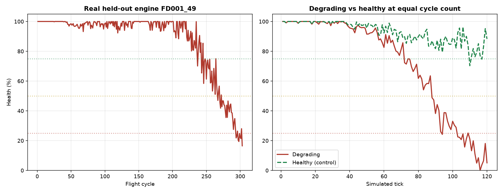

# ML — Drone Health Prediction & Mission Trajectories

**Owner:** Rohit ([@vrrroro](https://github.com/vrrroro))

Two deliverables for the backend:

1. **Health scoring** — turn drone telemetry into a 0–100 health score, from a model trained
   on NASA's real turbofan run-to-failure data.
2. **Mission trajectories** — waypoint lists extracted from real ADS-B flight telemetry.

---

## Results

Trained on **160,359 cycles from 709 real engines** (NASA C-MAPSS FD001–FD004). Scored on
NASA's **707 held-out test engines** against the ground-truth RUL files shipped with the
dataset.

| Model | RMSE (cycles) | MAE | R² | PHM08 | File size |
| --- | --- | --- | --- | --- | --- |
| RandomForest (tuned) | 15.62 | 11.53 | 0.862 | 3497 | 86.7 MB |
| **HistGradientBoosting** ← shipped | **14.78** | **10.50** | **0.877** | **3095** | **2.1 MB** |

Gradient boosting won on accuracy and is 40× smaller, so it is the model that ships. The
tuned forest is still trained and scored on every run so the comparison stays honest.

Per-subset RMSE, which tracks difficulty exactly as you would hope:

| Subset | Engines | RMSE | Conditions |
| --- | --- | --- | --- |
| FD001 | 100 | 12.67 | 1 condition, 1 fault mode |
| FD002 | 259 | 14.96 | 6 conditions, 1 fault mode |
| FD003 | 100 | 12.53 | 1 condition, 2 fault modes |
| FD004 | 248 | 16.14 | 6 conditions, 2 fault modes |

### How to read these numbers

**Engines are split, never rows.** Consecutive cycles of one engine are nearly identical, so
splitting rows at random lets a model memorise an engine and then be graded on that same
engine. It produces a flattering score and a model that fails on the first unseen airframe.
Every number above comes from engines that appear in no part of training.

`PHM08` is the original NASA challenge score, which penalises late predictions far more
steeply than early ones, because claiming an engine is fine when it is about to fail is the
expensive mistake. Lower is better.

---

## Sanity checks

`python sanity_check.py` — all four pass:

| Check | Result |
| --- | --- |
| Real held-out engine's health declines over its true history | 100% → 22.6% |
| **Model reads sensors, not the clock** | 83-point gap between degrading and flat traces at the same cycle |
| Predictions track true remaining life across 707 engines | Spearman ρ = 0.907, mean error 8.4 points |
| Simulated telemetry declines smoothly | 100% → 5.1% |

The second check is the one that matters most. `cycle` is one of the model's features, so a
model could score well on a degradation trace purely by counting flights and never looking
at a sensor — and it would then be useless on real hardware, where a well-maintained drone
on its 300th flight is healthy. The check runs two traces to the same cycle count, one
degrading and one with every sensor pinned at its healthy value. The flat trace stays at
88.3% while the degrading one falls to 5.1%, so the score is genuinely driven by sensor
evidence.

On the single held-out engine in check 1, the model predicted **20.6 cycles** of remaining
life at the final reading against a ground truth of **21**.



---

## Files

| File | Purpose |
| --- | --- |
| `rul_model.joblib` | Trained model bundle: estimator, feature list, RUL cap (2.1 MB) |
| `predict.py` | `predict_health`, `HealthMonitor`, telemetry simulator — **the backend entry point** |
| `trajectories.json` | 8 real flight paths, 160 waypoints |
| `cmapss.py` | Data loading and feature engineering, shared by train and serve |
| `train_model.py` | Training, tuning and held-out evaluation |
| `build_trajectories.py` | Selects clean tracks from the ADS-B capture |
| `sanity_check.py` | The four checks above |
| `model_metadata.json` | Full metrics from the last training run |

---

## Setup

```bash
cd drone-airspace-guardian/ml
python -m venv venv
venv\Scripts\activate          # Windows
# source venv/bin/activate     # macOS / Linux
pip install -r requirements.txt
```

Inference needs only `rul_model.joblib`, `predict.py` and `cmapss.py`. The raw datasets are
required solely for retraining and are deliberately not committed.

---

## Using it from the backend

### Live telemetry (recommended)

Degradation is a trend, not a value. Engines leave the factory with different baselines, so
one isolated reading cannot distinguish a drone that runs warm from one that is failing.
`HealthMonitor` keeps per-drone history and is the accurate path:

```python
from predict import HealthMonitor

monitors = {}   # drone_id -> HealthMonitor

def on_telemetry(drone_id: str, reading: dict) -> dict:
    monitor = monitors.setdefault(drone_id, HealthMonitor(drone_id))
    return monitor.update(reading)
```

Returns:

```python
{
    "drone_id": "dr-01",
    "cycle": 87,
    "rul_cycles": 41.8,
    "health": 33.4,
    "status": "service_soon",
    "history_length": 22,
}
```

`status` is one of `healthy` (≥75), `monitor` (≥50), `service_soon` (≥25), `ground_now`
(<25). Memory per drone is bounded — the monitor keeps only the first cycle, which anchors
drift, and the last 20 cycles, which fill the rolling windows. Nothing else is ever read.

### Single reading

```python
from predict import predict_health

health = predict_health(reading)   # 0-100
```

This works and is the requested interface, but with no history the rolling windows collapse
to the single row and drift is zero — the same feature pattern the model saw for cycle-1
rows in training. It is a valid input carrying less evidence, so it reads optimistically.
Prefer `HealthMonitor` for a live feed.

### Expected reading format

```python
{
    "cycle": 87,          # flight number for this airframe
    "setting1": 0.0,      # operating conditions
    "setting2": 0.0,
    "setting3": 100.0,
    "sensor1": 518.67,    # sensor1 .. sensor21
    ...
    "sensor21": 23.36,
}
```

### Stand-in telemetry until real drones are wired up

```python
from predict import simulate_drone_telemetry

trace = simulate_drone_telemetry(num_ticks=120)      # new -> worn out
healthy = simulate_drone_telemetry(num_ticks=120, failure_at=10**6)   # stays healthy
```

Each channel starts at its measured healthy value and moves toward its measured worn-out
value on an accelerating curve, with realistic noise. Those constants come from the first and
last 20 cycles of the real FD001 engines, so simulated readings land in the range the model
was actually trained on.

---

## Trajectories

```python
import json

data = json.load(open("ml/trajectories.json"))
for traj in data["trajectories"]:
    for wp in traj["waypoints"]:
        wp["lat"], wp["lon"], wp["alt_m"], wp["t_offset_s"]
```

8 aircraft selected from 214 in the capture. Candidates had to be tracked in all 20
snapshots, airborne throughout, free of gaps in the required channels, and have travelled
more than 5 km; survivors were then ranked by evenness of spacing, speed consistency,
gentleness of turns, path straightness and level flight. All 8 have straightness 1.000 and
turn less than 1° across the whole track, so replaying them will not teleport a drone
between waypoints.

Two altitude fields per waypoint:

- `alt_m` — real barometric altitude from ADS-B (airliner cruise, ~10,000 m).
- `alt_m_drone_scaled` — **derived, not measured.** The same altitude profile rescaled into
  60–120 m so demo missions look like drone flights. Use this one for the demo; use `alt_m`
  if you need the true telemetry.

`t_offset_s` is seconds since the first waypoint (snapshots are ~20 s apart), so replay can
be paced correctly.

---

## Retraining

The raw datasets are not in the repo. Point the scripts at them:

```bash
# Defaults assume C:\Users\rohit\Downloads\Datasets\...
set CMAPSS_DIR=path\to\CMAPSSData
set OPENSKY_CSV=path\to\opensky_trajectories.csv

python train_model.py         # ~7 min: loads, tunes, fits both models, evaluates, saves
python build_trajectories.py  # ~3 s
python sanity_check.py        # ~70 s, exits non-zero if any check fails
```

`train_model.py` rewrites `rul_model.joblib` and `model_metadata.json` and always reports
metrics from the held-out engines, so a regression shows up immediately.

---

## Design notes

**Why RUL is capped at 125 cycles.** Sensor readings carry no information about failure
beyond that horizon — an engine 200 cycles from failure looks identical to one 300 cycles
away. Regressing on the raw number forces the model to waste capacity separating two
indistinguishable states. Capping is the standard piecewise-linear target for this dataset.
The health score is anchored to the same cap, so 100% means "at or beyond the furthest point
the data can distinguish" rather than an invented maximum lifespan.

**Why features are defined in one place.** `cmapss.build_features` is imported by both
training and inference. If the two computed features differently, the model would score live
telemetry in a different feature space than it learned and return confident nonsense. Every
rolling window uses `min_periods=1` so a partially filled window behaves identically during
training and during live streaming.

**What the features are.** Per channel: the raw value, rolling mean over 5 and 20 cycles
(suppressing the sensor noise the dataset documents), rolling standard deviation (erratic
readings are themselves a wear signal), drift from the engine's own first cycle (which
cancels its individual factory baseline), and short-minus-long-window mean as a cheap slope
estimate. 145 features total.

---

## Known limitations

- Trained on **turbofan** degradation, not quadcopter degradation. The physics of the
  degradation signal transfers, but the specific 21 channels are engine sensors. When real
  drone telemetry exists, retrain rather than assuming the mapping holds.
- `predict_health` on a lone reading is optimistic by design; see above.
- `alt_m_drone_scaled` is synthesised for demo realism and is not measured data.
- The trajectory capture is a single ~7-minute window over the Indian subcontinent, so all
  8 paths are cruise segments. There are no takeoffs, landings or sharp manoeuvres.
