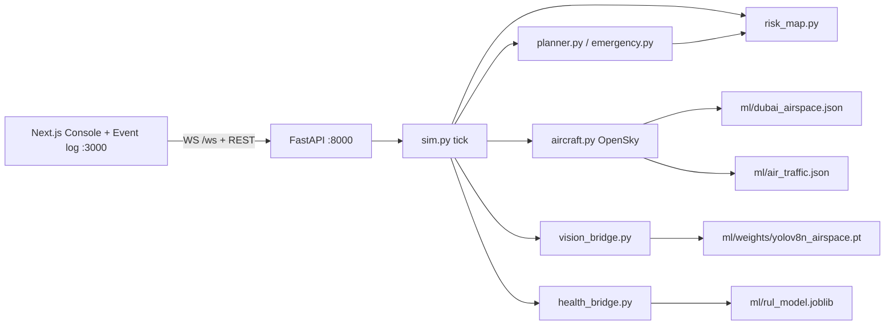

# Drone Airspace Guardian — runbook

Same-laptop BVLOS console over **real Downtown Dubai airspace**. An opening fleet of **eight** simulated drones (plus **Add drone**) flies missions planned with weighted A\* on OSM restricted polygons. The operator draws no-fly rings, places emergency zones, and watches escapes, 4-D deconfliction, OpenSky traffic, AU-AIR ground cameras, and C-MAPSS health — without a radio link.

The public GitHub landing page is the repo-root [README.md](../README.md) (hackathon pitch). This file is how to run it. Snapshot notes: [context.md](context.md) — prefer the code if they disagree.

Team split by folder. Stay in your area unless a change is coordinated.

| Path | Owner | GitHub |
| --- | --- | --- |
| `backend/` | Pranav | [@pranav3086](https://github.com/pranav3086) |
| `frontend/` | Joel | [@joelmathewgeorge](https://github.com/joelmathewgeorge) |
| `ml/` | Rohit | [@vrrroro](https://github.com/vrrroro) |

Ownership is recorded in [`.github/CODEOWNERS`](../.github/CODEOWNERS).

## What is running

- **Console** (`/`) — Leaflet map (Esri imagery), HUD **SAFE / CAUTION / CONFLICT / EMERGENCY**, fleet battery vs health, MapToolbar (**Add drone**, **Draw no-fly**, **Trigger emergency**, **Reset**), OpenSky feed, ground cameras, event ticker. Sim speed **1× / 2× / 4×** in the top bar.
- **Event log** (`/events`) — every planner decision, filterable, JSON export.
- **FastAPI** — in-memory sim. No database. CORS `allow_origins=["*"]`.

The drones are simulated. The airspace (39 OSM polygons including DXB / Al Minhad approach funnels), OpenSky tracks, YOLO weights, and C-MAPSS model are real artifacts.

## Architecture



Broadcast is ~1 s wall time (`TICK_S`). Physics sub-steps at 0.25 s. A\* only re-runs when the risk map or a route is dirty.

## How to run

Ports match the code: uvicorn **8000**; `frontend/lib/config.ts` defaults `NEXT_PUBLIC_API_BASE_URL` to `http://127.0.0.1:8000` and `NEXT_PUBLIC_WS_URL` to `ws://127.0.0.1:8000/ws`; `npm run dev` listens on **3000**.

Use one Python environment. The team runs **`ml/venv`**. Install `ml/requirements.txt` (sklearn, ultralytics) and `backend/requirements.txt` (FastAPI, numpy) into it. Without YOLO the map and planner still run; `vision_bridge` logs that the detector is unavailable and ground sites use dataset labels.

`--reload` restarts uvicorn on save. Drop it for a stable judge demo.

### Backend (FastAPI, 8000)

```powershell
cd drone-airspace-guardian\ml
python -m venv venv          # skip if ml\venv already exists
.\venv\Scripts\activate
python -m pip install -r requirements.txt
python -m pip install -r ..\backend\requirements.txt
cd ..\backend
$env:AIR_TRAFFIC = "replay"  # judge-safe; omit to poll live OpenSky
python -m uvicorn main:app --host 127.0.0.1 --port 8000 --reload
```

`GET http://127.0.0.1:8000/` should include `"city": "dubai"`. Optional smoke: `python test_server.py` (Downtown Dubai coords, current REST surface).

### Frontend (Next.js, 3000)

```powershell
cd drone-airspace-guardian\frontend
npm install
npm run dev
```

Open http://localhost:3000. Top bar feed should read **Live**. **Offline** means the UI is up but FastAPI is not on 8000.

| Variable | Default | Purpose |
| --- | --- | --- |
| `NEXT_PUBLIC_API_BASE_URL` | `http://127.0.0.1:8000` | REST |
| `NEXT_PUBLIC_WS_URL` | `ws://127.0.0.1:8000/ws` | Stream |
| `AIR_TRAFFIC` (process env) | `live` | `replay` uses `ml/air_traffic.json` |

Ground cameras need `ml/auair_frames/` (run `python ml/export_auair_frames.py` against a local AU-AIR copy). If that directory is missing, the backend falls back to `ml/vision_frames/` VisDrone stills, or a fixed MEDIUM level with an empty frame.

## HTTP and WebSocket surface

All of these are defined in `backend/main.py`. Zone body: `{ "lat", "lon", "radius"? }` metres. Toolbar posts operator rings at **450 m** and emergencies at the selected **500 / 700 / 1000 / 1400 m** (backend default 700 if omitted).

| Method | Path | What it does |
| --- | --- | --- |
| `WS` | `/ws` | `hello` (event history, `reset: true` after reset), then `state` ~1 Hz and `events` bursts |
| `GET` | `/` | Health: city, drone count, restricted-area count, `airTraffic`, detector |
| `GET` | `/world` | Static OSM map + planner constants |
| `GET` | `/state` | Full snapshot |
| `GET` | `/events` | `{ "events": [...] }` (`?limit=`) |
| `POST` | `/drones` | `{ "mode": "auto" \| "random" \| "encounter" }` — toolbar uses `auto` |
| `POST` | `/zones` | Operator no-fly (cap 4; oldest dropped) |
| `POST` | `/emergency` | Emergency zone (cap 3) |
| `DELETE` | `/zones/{id}` | Lift a drawn zone (map popup **Lift no-fly zone** / **Lift emergency**) |
| `POST` | `/sim` | `{ "speed": 1 \| 2 \| 4 }` |
| `POST` | `/reset` | Opening eight-drone fleet, zones cleared, log restarted |
| `GET` | `/media/auair/...` | AU-AIR frames |
| `GET` | `/media/visdrone/...` | VisDrone frames |

`POST /drones` → `{ "drone": {...}, "predictedConflicts": [...] }`.  
`POST /reset` → `{ "status": "reset", "drones": N }`.

## 90-second demo

Button labels are from `frontend/components/MapToolbar.tsx` and `TopBar.tsx`.

1. **0:00 — board.** http://localhost:3000. **Live**, **Dubai drone airspace**, eight tracks, HUD, **Fleet** battery + health.
2. **0:15 — traffic.** **OpenSky live** or **OpenSky replay**. Aerial detection feed lists airliners and helicopters.
3. **0:25 — add.** **Add drone** → notice *launched on a clear route* or *Conflict predicted with …*.
4. **0:40 — no-fly.** **Draw no-fly**, click the map (450 m). Escape to cancel. Popup **Lift no-fly zone** to delete.
5. **0:55 — emergency.** Pick a radius, **Trigger emergency**, click Downtown. Banner reports who is escaping; they rejoin the original route when clear.
6. **1:10 — cameras.** **Ground monitor** cycles road sites; YOLO (or dataset labels) sets overflight cost.
7. **1:20 — log.** **Event log** tab → **Pause live updates** / **Export … as JSON**.
8. **1:25 — reset.** **Reset**. Speed: **1× 2× 4×**.

## Datasets

Raw captures are not in git. Point the build/train scripts at local copies.

| Dataset | Role | In the running demo |
| --- | --- | --- |
| OSM / Overpass | `ml/build_airspace.py` → `dubai_airspace.json` | Yes — 39 restricted polygons, 8 ports, roads, water |
| OpenSky | Live poll + `ml/build_air_traffic.py` → `air_traffic.json` (8 flights at DXB 30L) | Yes as manned traffic. Not drone paths |
| NASA C-MAPSS FD001–FD004 | `rul_model.joblib` (HistGradientBoosting, RMSE 14.78 cycles) | Yes — `health_bridge.py` on synthetic traces |
| VisDrone2019-DET | `yolov8n_airspace.pt`, mAP50 **0.3182** | Yes as the detector; frames optional fallback |
| AU-AIR | `export_auair_frames.py` → `ml/auair_frames/` (gitignored) | Yes when exported |

Health training (optional, not needed to demo): `ml/train_model.py`, `ml/sanity_check.py` (`ml/README.md`). Detector already ships in `ml/weights/`; `ml/train_yolov8n.py` is optional.

## Known limitations

- Software fleet. No C2, no physical UAV.
- OpenSky replay is airliner ADS-B re-anchored to DXB. Live OpenSky may need `AIR_TRAFFIC=replay`.
- Health is turbofan RUL; battery is a separate energy model (`drones.py`).
- Cameras replay stills. YOLO mAP50 0.3182. AU-AIR frames are local-only.
- In-memory state. Restart wipes the fleet, zones, and log.
- Live UI is `app/page.tsx` → `Console`.
