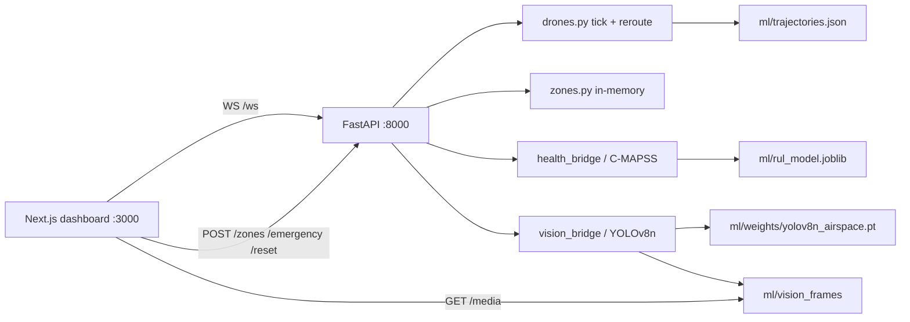

# Drone Airspace Guardian

Downtown Dubai MVP: five simulated delivery drones on a live map, operator no-fly rings, an inbound-helicopter emergency that reroutes traffic in place, C-MAPSS health scores, and a YOLOv8n camera dock on cycling aerial frames.

The public GitHub landing page is the repo-root [README.md](../README.md). This file is the operational runbook (ports, commands, API table). Deep restore notes: [context.md](context.md).

Team split by folder. Stay in your area unless a change is coordinated.

| Path | Owner | GitHub |
| --- | --- | --- |
| `backend/` | Pranav | [@pranav3086](https://github.com/pranav3086) |
| `frontend/` | Joel | [@joelmathewgeorge](https://github.com/joelmathewgeorge) |
| `ml/` | Rohit | [@vrrroro](https://github.com/vrrroro) |

Ownership is recorded in the repo-root [`.github/CODEOWNERS`](../.github/CODEOWNERS): Rohit = ML (`@vrrroro`), Pranav = backend (`@pranav3086`), Joel = frontend (`@joelmathewgeorge`).

## Pitch

An operator watches Downtown Dubai (25.1972 N, 55.2744 E). Five missions loop on paths shaped from real OpenSky ADS-B tracks, fitted into a Downtown box around Burj Khalifa (`SPAN_DEG = 0.024` in `missions.py`). Drawing a no-fly ring, or clicking **Helicopter inbound**, marks affected drones, redraws their routes, and raises the conflict banner. A second helicopter click replaces the emergency ring instead of stacking another. Health bars come from the trained C-MAPSS RUL model on stand-in telemetry. The camera panel runs YOLOv8n on a rotating set of VisDrone / Dubai stills served from the backend, not a live UAV feed.

## Architecture

```
  Browser  (Next.js, port 3000)
     |  Leaflet map + drone panel + camera dock
     |  WS  ws://127.0.0.1:8000/ws
     |  HTTP POST /zones  /emergency  /reset
     |  HTTP GET  /  /state  /zones  /media/<frame>
     v
  FastAPI  (uvicorn, port 8000)
     |-- simulation_loop (~1 s) --> drones.py lerp / reroute / proximity
     |-- zones.py (in-memory circles; emergencies replace, operators cap at 4)
     |-- health_bridge.py --> ml/rul_model.joblib
     |-- vision_bridge.py --> ml/weights/yolov8n_airspace.pt
     '-- StaticFiles /media --> ml/vision_frames/
```



State lives in the FastAPI process. There is no database. CORS is open (`allow_origins=["*"]`) for local development.

## How to run

Ports below match the code: `uvicorn` defaults to **8000**; `frontend/lib/config.ts` defaults `NEXT_PUBLIC_API_BASE_URL` to `http://127.0.0.1:8000` and `NEXT_PUBLIC_WS_URL` to `ws://127.0.0.1:8000/ws`; `npm run dev` is stock Next and listens on **3000**.

Use one Python environment for the API. Install `backend/requirements.txt` for the server and health model, then `ml/requirements.txt` if you want the camera HUD (`ultralytics`). Without YOLO, the map and reroutes still run; `vision_bridge` logs that the detector is unavailable.

`--reload` watches Python files and restarts uvicorn on save. Use it while developing; drop the flag for a stable judge demo.

### Backend (FastAPI, 8000)

```powershell
cd drone-airspace-guardian\backend
python -m venv .venv
.venv\Scripts\activate          # Windows
# source .venv/bin/activate     # macOS / Linux
python -m pip install -r requirements.txt
python -m pip install -r ..\ml\requirements.txt
python -m uvicorn main:app --host 127.0.0.1 --port 8000 --reload
```

Sanity check without the UI:

```bash
python -m websockets ws://127.0.0.1:8000/ws
```

You should see a JSON `positions` message about once a second with `"city": "dubai"`.

### Frontend (Next.js, 3000)

```powershell
cd drone-airspace-guardian\frontend
npm install
npm run dev
```

Open http://localhost:3000. The header feed should read **Live** once the WebSocket connects.

Optional environment (frontend):

| Variable | Default | Purpose |
| --- | --- | --- |
| `NEXT_PUBLIC_DATA_MODE` | `live` (anything other than `mock`) | `mock` uses the in-browser simulator only |
| `NEXT_PUBLIC_API_BASE_URL` | `http://127.0.0.1:8000` | REST base |
| `NEXT_PUBLIC_WS_URL` | `ws://127.0.0.1:8000/ws` | Position stream |

## HTTP and WebSocket surface

All of these are defined in `backend/main.py`. Zone bodies are `{ "lat": float, "lon": float, "radius": float }` with radius in metres. The dashboard posts no-fly rings at **450 m** and the helicopter emergency at **900 m** on the Dubai center (25.1972, 55.2744).

| Method | Path | What it does |
| --- | --- | --- |
| `GET` | `/` | Health check: service name, `status`, `city: "dubai"`, drone and zone counts |
| `GET` | `/state` | Snapshot of drones, zones, vision payload, and city |
| `GET` | `/zones` | `{ "zones": [...] }` |
| `POST` | `/zones` | Create an operator no-fly circle. Conflict check runs on the next sim tick |
| `POST` | `/emergency` | Create an emergency circle, force an immediate reroute check, broadcast a WS `alert` |
| `POST` | `/reset` | Clear zones, rebuild the five Dubai missions, broadcast a `positions` snapshot with `reset: true` |
| `WS` | `/ws` | Accepts the client, sends a snapshot, then broadcasts `positions` about every 1 s (`drones`, `zones`, `vision`, `city`, `timestamp`) |
| `GET` | `/media/...` | Static files from `ml/vision_frames/` when that directory exists (camera stills) |

`POST /emergency` response: `{ "status": "emergency_created", "zone": {...}, "affected_drones": ["drone-1", ...] }`.

`POST /reset` response: `{ "status": "reset", "drones": 5, "zones": 0 }`.

## 90-second demo

1. **0:00 — board.** Open http://localhost:3000. Confirm **Live**, five tracks, Downtown Dubai tiles, health bars in the left panel, camera dock on the right.
2. **0:15 — traffic.** Let the fleet move. Missions are Marina clinic, Palm grocery, Sheikh Zayed survey, DIFC parts, and organ to Emirates Hospital.
3. **0:25 — no-fly.** Click **Draw no-fly**, then click the map. A 450 m operator ring appears; drones that intersect it mark **rerouting** and the banner updates.
4. **0:40 — helicopter.** Click **Helicopter inbound**. The API drops a 900 m emergency on the Dubai center, immediately checks conflicts, and the banner reports how many drones are affected. Clicking it again replaces that ring (single emergency, not stacked fills).
5. **1:00 — camera.** The dock cycles stills with YOLOv8n boxes (cars, people, buses, and related classes). This is ground-activity context, not drone-vs-drone detection.
6. **1:15 — health.** Watch the left **Fleet** panel: C-MAPSS RUL scores walk down on stand-in traces.
7. **1:25 — reset.** Click **Reset demo**. Zones clear, the original five missions restore, the banner drops.

Escape cancels an armed draw. If the feed shows **Disconnected**, the UI is up but FastAPI is not reachable on port 8000.

## Datasets

Raw captures are not in git. Point the training scripts at local copies (defaults under `C:\Users\rohit\Downloads\Datasets\...`).

| Dataset | Role in this MVP | In the running demo |
| --- | --- | --- |
| OpenSky ADS-B | Real cruise tracks selected by `ml/build_trajectories.py` into `ml/trajectories.json` | Yes — five tracks are fitted into the Dubai box by `backend/missions.py`. Fallback legs in `drones.py` if the JSON is missing |
| NASA C-MAPSS (FD001–FD004) | Train `ml/rul_model.joblib` (HistGradientBoosting, held-out RMSE 14.78 cycles) | Yes — `health_bridge.py` scores stand-in telemetry each tick. Not onboard UAV sensors |
| VisDrone2019-DET | Fine-tune YOLOv8n (`ml/train_yolov8n.py` writes `ml/weights/yolov8n_airspace.pt`) and export demo frames | Yes — `vision_bridge.py` on cycling stills. Frames themselves are gitignored |
| Dubai aerial plates | Map context | Yes — `frontend/public/dubai/tile-a.png` … `tile-d.png` over the Leaflet base |
| Dubai segmentation / AU-AIR | Mentioned in `ml/PROMPT.md` as later terrain / mission sources | Not on the live path. Missions are OpenSky-shaped, not AU-AIR GPS |

Health training and checks: `ml/train_model.py`, `ml/sanity_check.py` (see `ml/README.md`). Detector training: `ml/train_yolov8n.py`.

## Known limitations (simulated vs real)

- The five drones are a software fleet. Nothing here commands or tracks a physical UAV.
- OpenSky paths are airliner ADS-B, then scaled and offset into Downtown Dubai. They are not Dubai drone flights.
- Health is a turbofan RUL model driven by synthetic C-MAPSS-like traces. Real airframe telemetry would need a new training set.
- The camera dock is not a live gimbal. It classifies a loop of stills; `/media` is empty if `ml/vision_frames/` is missing locally.
- VisDrone is street-level aerial traffic, not Dubai airspace and not drone detection. Fine-tune mAP50 is **0.2863** — modest, not production detection.
- Zones and fleet state are in-memory and vanish on process restart.
- Proximity is a geometric check: horizontal distance under 100 m and altitude separation under 30 m.
- `NEXT_PUBLIC_DATA_MODE=mock` is a frontend-only fake and does not hit FastAPI.
- Debug session logs (`debug-*.log`) may reappear while leftover backend instrumentation is still running; they are gitignored at the repo root.
